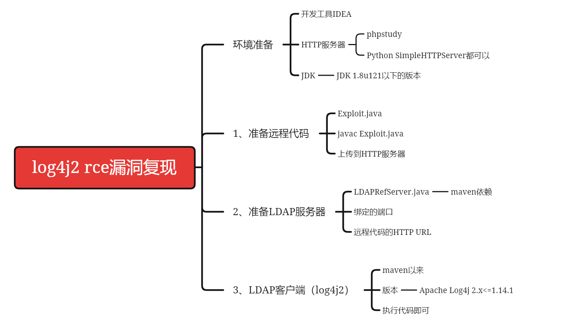

# CVE-2021-44228

> 涉及元件：Java-Log4j
> 
> 可利用性：极高
> 
> 危险性：极高
> 
> 利用成本：几乎没有
> 
> 可被溯源性：因极大概率涉及反弹shell操作，故不建议使用自己的VPS进行攻击操作

---

## 0x01 漏洞简介

Apache **Log4j2**是一个基于Java的日志记录工具。由于Apache  Log4j2某些功能存在递归解析功能，攻击者可直接构造恶意请求，触发远程代码执行漏洞。漏洞利用无需特殊配置，经阿里云安全团队验证，Apache Struts2、Apache Solr、Apache Druid、Apache Flink等均受影响。

漏洞适用版本为`2.0 <= Apache log4j2 <= 2.14.1`，只需检测Java应用是否引入 log4j-api , log4j-core 两个jar。若存在应用使用，极大可能会受到影响。

## 0x02 环境准备

Log4j这一次核弹级漏洞的无控制披露，导致非常多核心设施暴露在危险之下。在这里，不使用他人的服务器进行攻击实验，也不使用自己的电脑搭建靶机，故使用在线靶场做演示。

> NSSCTF-Apache log4j漏洞靶机：[NSSCTF](https://www.ctfer.vip/#/problem/1124)
> 
> NSSCTF-Vulfocus log4j2-rce靶机：[NSSCTF](https://www.ctfer.vip/#/problem/1125)
> 
> CTFShow-Log4j复现：[ctf.show](https://ctf.show/challenges#Log4j%E5%A4%8D%E7%8E%B0-1730)

如果一定要在本地搭建，这里给出相关步骤：

首先，建议使用IDEA搭建环境，毕竟IDE搭建Java环境，方便调试，也便于控制。
