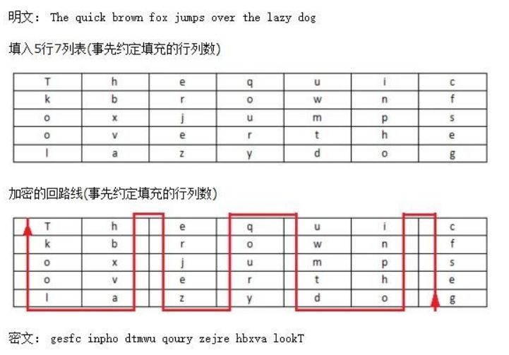
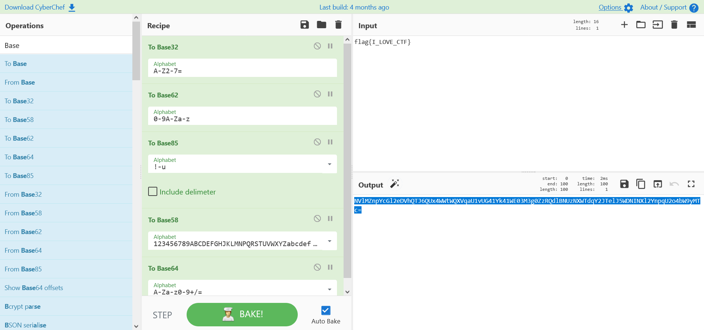
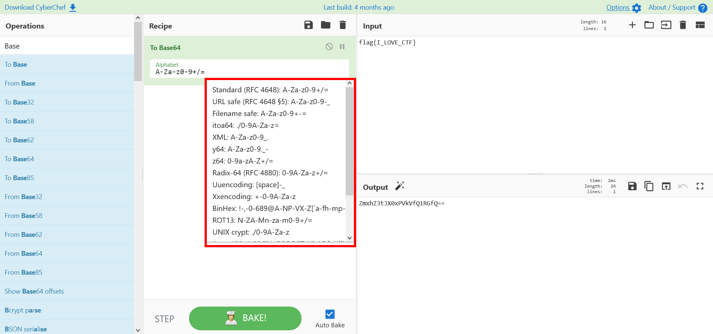
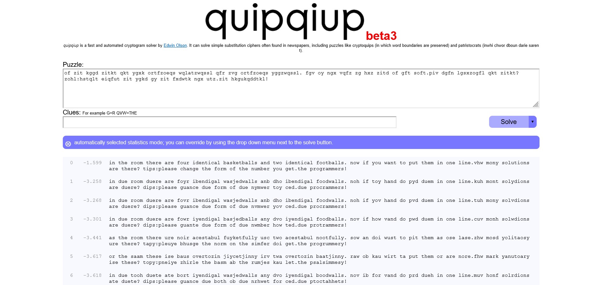

# Crypto-密码学基础和古典密码

密码学（Cryptography）一般可分为古典密码学和现代密码学。

## 基础

其中，古典密码学，作为一种实用性艺术存在，其编码和破译通常依赖于设计者和敌手的创造力与技巧，并没有对密码学原件进行清晰的定义。古典密码学主要包含以下几个方面：

-   单表替换加密（Monoalphabetic Cipher）
-   多表替换加密（Polyalphabetic Cipher）
-   奇奇怪怪的加密方式

而现代密码学则起源于 20 世纪中后期出现的大量相关理论，1949 年香农（C. E. Shannon）发表了题为《保密系统的通信理论》的经典论文标志着现代密码学的开始。现代密码学主要包含以下几个方面：

-   对称加密（Symmetric Cryptography），以 DES，AES，RC4 为代表。
-   非对称加密（Asymmetric Cryptography），以 RSA，ElGamal，椭圆曲线加密为代表。
-   哈希函数（Hash Function），以 MD5，SHA-1，SHA-512 等为代表。
-   数字签名（Digital Signature），以 RSA 签名，ElGamal 签名，DSA 签名为代表。

其中，对称加密体制主要分为两种方式：

-   分组密码（Block Cipher），又称为块密码。
-   序列密码（Stream Cipher），又称为流密码。

一般来说，密码设计者的根本目标是保障信息及信息系统的

-   机密性（Confidentiality）
-   完整性（Integrity）
-   可用性（Availability）
-   认证性（Authentication）
-   不可否认性（Non-repudiation）

其中，前三者被称为信息安全的 CIA 三要素 。

而对于密码破解者来说，一般是要想办法识别出密码算法，然后进行暴力破解，或者利用密码体制的漏洞进行破解。当然，也有可能通过构造虚假的哈希值或者数字签名来绕过相应的检测。

一般来说，我们都会假设攻击者已知待破解的密码体制，而攻击类型通常分为以下四种：

| 攻击类型     | 说明                                       |
| ------------ | ------------------------------------------ |
| 唯密文攻击   | 只拥有密文                                 |
| 已知明文攻击 | 拥有密文与对应的明文                       |
| 选择明文攻击 | 拥有加密权限，能够对明文加密后获得相应密文 |
| 选择密文攻击 | 拥有解密权限，能够对密文解密后获得相应明文 |

>   以上材料节选自CTF Wiki
>
>   ~~没办法的事，毕竟大佬们归纳得肯定比我好。。~~

在这里，推荐几款工具，用于做编码分析和密文解密（避免无谓的造轮子）

>   CyberChef：https://gchq.github.io/CyberChef/	瑞士军刀
>
>   CTF在线工具：http://www.hiencode.com/	类比于CyberChef，但是没有那么方便
>
>   一个工具箱：http://www.atoolbox.net/Category.php?Id=28	一些奇奇怪怪的单表替换密码，基本上都可以在这里找到

## 编码

编码是信息从一种形式或格式转换为另一种形式的过程，也称为计算机编程语言的代码简称编码。用预先规定的方法将文字、数字或其它对象编成数码，或将信息、数据转换成规定的电脉冲信号。编码在电子计算机、电视、遥控和通讯等方面广泛使用。编码是信息从一种形式或格式转换为另一种形式的过程。解码，是编码的逆过程。

常见编码有以下这些：

1.   ASCII编码

2.   Base64/32/16编码

3.   shellcode编码

4.   Quoted-printable编码

5.   XXencode编码

6.   UUencode编码

7.   URL编码

8.   Unicode编

9.   Escape/Unescape编码

10.   HTML实体编码

11.   敲击码(Tap code)

12.   莫尔斯电码(Morse Code)

13.   编码的故事

对于ASCII编码和Base编码来说，由于涉及表对应，导致更改映射表就可以形成新的密码，使得这两个编码家族来说，可变性很大。同时，这两个编码家族之中存在有许多种类，光光Base家族就存在以下这些编码：

-   Base16
-   Base32
-   Base36
-   Base58
-   Base62
-   Base64
-   Base64Url
-   Base85
-   Base91
-   Base92
-   Base100

面对这类情况，在自己手动搜索的同时，选手也要善于使用工具。这里给出两种自动化分析的姿势：

1.   使用CyberChef

CyberChef中，在右侧的功能栏中，可以看到有一个`Magic`，这个功能就可以自动识别出可能存在的编码，并尝试解码（有的时候对于变异Base有奇效）。对于识别不出来的题目，现场搜索引擎也不失为一个好选择。

2.   使用Basecrack

     >    mufeedvh/basecrack	https://github.com/mufeedvh/basecrack

这是一个全自动化的Base家族解密工具，依赖于Python运行。只需执行：

```shell
Python basecrack.py -m
```

即可实现Base家族自动检测编码方式，并且还可以解决嵌套编码，如：Base32–> Base85–>base91–>Base32这种嵌套编码。

上面这些还可以算是正常的编码，有一些神奇编码，比如说Emoji编码，猪圈编码，社会主义核心价值观编码等等，这种题目就~~直接问问神奇海螺好了~~最好还是现场查资料吧。。

摩斯电码的话，由于存在多种标志的可能，故推荐http://www.all-tool.cn/Tools/morse/?&rand=877dcea10d348714aa4f3d28fa6514ac

脑洞加密可以参考：https://ctf-wiki.org/crypto/classical/others/#_19

## 加密

### 0x01 换位加密

#### 1.栅栏密码(Rail-fence Cipher)

栅栏密码比较坑人，因为它控制加密的参数有两种模式，一种是控制分几组加密，一种是分一组有几个字符，两种模式导致了加密结果的不同，也导致了要区分不同情况来解密。举个例子：
```
原文：ABCDEFGHIJKL

分四个组进行加密：ABC	DEF	GHI	JKL  –> ADGJBEHKCFIL

分一组四字来加密：ABCD	EFGH	IJKL  –> AEIBFJCGKDHL
```
同时还存在W型加密：W型栅栏密码加密的方法中，明文由上至下顺序写上，当到达最低部时，再回头向上，一直重复直至整篇明文写完为止。此例子中，其包含了三栏及一段明文：'WEAREDISCOVEREDFLEEATONCE'。如下：

```
W . . . E . . . C . . . R . . . L . . . T . . . E
. E . R . D . S . O . E . E . F . E . A . O . C .
. . A . . . I . . . V . . . D . . . E . . . N . .
```
按行读取后的密文：

WECRLTEERDSOEEFEAOCAIVDEN

W型的加密密钥就不只能是字符串长度的因子，小于其长度的任何一个数都可能是其key值，所以第一步也是确定密钥。

这里给出在线工具：

>   分每组字数加解密：[栅栏密码加密解密](https://www.qqxiuzi.cn/bianma/zhalanmima.php)
>
>   分组数进行加解密：[栅栏密码加密/解密【传统型】](http://www.atoolbox.net/Tool.php?Id=855)
>
>   W型加密：[栅栏密码加密/解密【W型】](http://www.atoolbox.net/Tool.php?Id=777)	

####     2.曲路密码(Curve Cipher)

曲路密码(Curve Cipher)是一种换位密码，需要事先约定填充的行列数(也就是曲路路径)



可以用这个Python代码来加解密：

```python
# 曲路密码
import re


def encrypt_bend(string, col, row=10):
    ciphertext = ""
    temp = []
    for i in range(col):
        temp.append([])
    for index, i in enumerate(string):
        temp[index % col].append(i)
    re_temp = list(reversed(temp))
    for index, i in enumerate(re_temp):
        if index % 2 == 0:
            i = list(reversed(i))
        ciphertext += "".join(i)
    return ciphertext


def decrypt_bend(string, col, row=10):
    plaintext = ""
    length = len(string)
    min_row = length // col       # 最小的行数
    min_num = col - length % col  # 最小行数的列数
    # 分组
    temp = []
    index = 0
    for i in range(col):
        if i < min_num:
            temp.append(string[index:index+min_row])
            index += min_row
        else:
            temp.append(string[index:index+min_row+1])
            index += min_row + 1
    print(temp)
    # 改回列顺序
    for index, i in enumerate(temp):
        if index % 2 == 0:
            # print(re.findall(".{1}", temp[index]))
            temp[index] = "".join(
                list(reversed(re.findall(".{1}", temp[index]))))
    temp.reverse()
    for i in range(length):
        plaintext += temp[i % col][i // col]
    return plaintext


if __name__ == '__main__':
    col_ = int(input("col:"))
    row_ = int(input("row:"))
    case = input("input 1 -->encode\ninput 2 -->decode\nYour choose:")
    if case == "1":
        s_input = input("ciphertext:")
        ciphertext_ = encrypt_bend(s_input, col_, row_)
        print(f"{s_input} : {ciphertext_}")
    elif case == "2":
        s_input = input("plaintext:")
        plaintext_ = decrypt_bend(s_input, col_, row_)
        print(f"{plaintext_} : {s_input}")
```


 ####    3.列移位密码(Columnar Transposition Cipher)

位移算法描述：将某个字节数c据向后位移k位，超过字符集最大数m时，则取模

  y=(x+k) mod m

解密算法

  x=(y-k) mod m

暴力破解思路：尝试所有k，k的范围只在[1, m-1]才有意义

这里有在线工具：http://www.hiencode.com/colum.html

同时，基于Python的实现可以参考这篇文章：https://www.cnblogs.com/moox2020/p/14283956.html

同时，如果只加密字母的话，这就变成了凯撒加密。

同时，由于明文中每个字母都能与密文中的每个字母一一对应，故这类加密也叫做单表代换加密。对于这类加密，当数据足够大的时候，可以考虑词频分析来对表对应关系进行爆破。

在线词频分析网站：http://quipqiup.com/

#### 4. 仿射密码

##### 原理 

仿射密码的加密函数是：
$$
E(x)=(ax+b)\pmod m$
$$
，其中`x`表示明文按照某种编码得到的数字，`a` 和 `m` 互质，``m` 是编码系统中字母的数目。

解密函数是
$$
D(x)=a^{-1}(x-b)\pmod m
$$
，其中 
$$
a^{-1}
$$
 是 `a` 在 $\mathbb{Z}_{m}$ 群的乘法逆元。下面我们以

$$
E(x)=(5x+8)mod26
$$


 函数为例子进行介绍，加密字符串为 `AFFINE CIPHER`，这里我们直接采用字母表 26 个字母作为编码系统

| 明文   | A    | F    | F    | I    | N    | E    | C    | I    | P    | H    | E    | R    |
| ------ | ---- | ---- | ---- | ---- | ---- | ---- | ---- | ---- | ---- | ---- | ---- | ---- |
| x      | 0    | 5    | 5    | 8    | 13   | 4    | 2    | 8    | 15   | 7    | 4    | 17   |
| y=5x+8 |      |      |      |      |      |      |      |      |      |      |      |      |

|        | 8    | 33   | 33   | 48   | 73   | 28   | 18   | 48   | 83   | 43   | 28   | 93   |
| ------ | ---- | ---- | ---- | ---- | ---- | ---- | ---- | ---- | ---- | ---- | ---- | ---- |
| ymod26 |      |      |      |      |      |      |      |      |      |      |      |      |

|      | 8    | 7    | 7    | 22   | 21   | 2    | 18   | 22   | 5    | 17   | 2    | 15   |
| ---- | ---- | ---- | ---- | ---- | ---- | ---- | ---- | ---- | ---- | ---- | ---- | ---- |
| 密文 | I    | H    | H    | W    | V    | C    | S    | W    | F    | R    | C    | P    |

其对应的加密结果是 `IHHWVCSWFRCP`。

对于解密过程，正常解密者具有 a 与 b，可以计算得到 a^−1

 为 21，所以其解密函数是
$$
D(x)=21(x−8)(mod26)
$$
 ，解密如下

| 密文 | I    | H    | H    | W    | V    | C    | S    | W    | F    | R    | C    | P    |
| ---- | ---- | ---- | ---- | ---- | ---- | ---- | ---- | ---- | ---- | ---- | ---- | ---- |
| y    |      |      |      |      |      |      |      |      |      |      |      |      |

|           | 8    | 7    | 7    | 22   | 21   | 2    | 18   | 22   | 5    | 17   | 2    | 15   |
| --------- | ---- | ---- | ---- | ---- | ---- | ---- | ---- | ---- | ---- | ---- | ---- | ---- |
| x=21(y−8) |      |      |      |      |      |      |      |      |      |      |      |      |

|        | 0    | -21  | -21  | 294  | 273  | -126 | 210  | 294  | -63  | 189  | -126 | 147  |
| ------ | ---- | ---- | ---- | ---- | ---- | ---- | ---- | ---- | ---- | ---- | ---- | ---- |
| xmod26 |      |      |      |      |      |      |      |      |      |      |      |      |

|      | 0    | 5    | 5    | 8    | 13   | 4    | 2    | 8    | 15   | 7    | 4    | 17   |
| ---- | ---- | ---- | ---- | ---- | ---- | ---- | ---- | ---- | ---- | ---- | ---- | ---- |
| 明文 | A    | F    | F    | I    | N    | E    | C    | I    | P    | H    | E    | R    |

可以看出其特点在于只有 26 个英文字母。

##### 破解 

首先，我们可以看到的是，仿射密码对于任意两个不同的字母，其最后得到的密文必然不一样，所以其也具有最通用的特点。当密文长度足够长时，我们可以使用频率分析的方法来解决。

其次，我们可以考虑如何攻击该密码。可以看出当a=1

 时，仿射加密是凯撒加密。而一般来说，我们利用仿射密码时，其字符集都用的是字母表，一般只有 26 个字母，而不大于 26 的与 26 互素的个数一共有 

$$
\phi(26)=\phi(2) \times \phi(13) = 12
$$
算上 b 的偏移可能，一共有可能的密钥空间大小也就是 

$$
12 \times 26 = 312
$$
一般来说，对于该种密码，我们至少得是在已知部分明文的情况下才可以攻击。下面进行简单的分析。

这种密码由两种参数来控制，如果我们知道其中任意一个参数，那我们便可以很容易地快速枚举另外一个参数得到答案。

但是，假设我们已经知道采用的字母集，这里假设为 26 个字母，我们还有另外一种解密方式，我们只需要知道两个加密后的字母 y1,y2

 即可进行解密。那么我们还可以知道

$$
y_1=(ax_1+b)\pmod{26} \\
y_2=(ax_2+b)\pmod{26}
$$
两式相减，可得

$$
y_1-y_2=a(x_1-x_2)\pmod{26}
$$
这里 y1,y2已知，如果我们知道密文对应的两个不一样的字符 x1 与 x2 ，那么我们就可以很容易得到 a ，进而就可以得到 b 了。

### 0x02 多表代换加密

对于多表替换加密来说，加密后的字母几乎不再保持原来的频率，所以我们一般只能通过寻找算法实现对应的弱点进行破解。

相关资料请见：https://ctf-wiki.org/crypto/classical/polyalphabetic/

Bugku的工具不错，尤其是维吉尼亚的在线工具，效率挺高：https://ctf.bugku.com/tool/vigenere

## 例题

### 1. Base嵌套加密

这个我自己出一份密文：



```text
NVlMZnpYcGl2eDVhQTJ6QUx4WWtWQXVqaU1vUG41Yk41WE03M3g0ZzRQdlBNUzNXWTdqY2JTelJ5WDNINXl2YnpqU2o4bW9yMTc=
```

用`Basecrack`自动化识别看看：

```shell
randark@randark-VirtualBox:~/basecrack$ python basecrack.py -m

██████╗  █████╗ ███████╗███████╗ ██████╗██████╗  █████╗  ██████╗██╗  ██╗
██╔══██╗██╔══██╗██╔════╝██╔════╝██╔════╝██╔══██╗██╔══██╗██╔════╝██║ ██╔╝
██████╔╝███████║███████╗█████╗  ██║     ██████╔╝███████║██║     █████╔╝ 
██╔══██╗██╔══██║╚════██║██╔══╝  ██║     ██╔══██╗██╔══██║██║     ██╔═██╗ 
██████╔╝██║  ██║███████║███████╗╚██████╗██║  ██║██║  ██║╚██████╗██║  ██╗
╚═════╝ ╚═╝  ╚═╝╚══════╝╚══════╝ ╚═════╝╚═╝  ╚═╝╚═╝  ╚═╝ ╚═════╝╚═╝  ╚═╝ v4.0
    
                python basecrack.py -h [FOR HELP]

[>] Enter Encoded Base: NVlMZnpYcGl2eDVhQTJ6QUx4WWtWQXVqaU1vUG41Yk41WE03M3g0ZzRQdlBNUzNXWTdqY2JTelJ5WDNINXl2YnpqU2o4bW9yMTc=

[-] Iteration: 1

[-] Heuristic Found Encoding To Be: Base64

[-] Decoding as Base64: 5YLfzXpivx5aA2zALxYkVAujiMoPn5bN5XM73x4g4PvPMS3WY7jcbSzRyX3H5yvbzjSj8mor17



[-] Iteration: 2

[-] Heuristic Found Encoding To Be: Base58

[-] Decoding as Base58: 8PDTUDG=8(F_<USF%CLp2)@R95t>!g:K^S9<B3ie6[*HXG\g>L8p>:



[-] Iteration: 3

[-] Heuristic Found Encoding To Be: Ascii85

[-] Decoding as Ascii85: ILFXnMYGug6tsHwq53BmAGWfOYRrU9OfCwobxlTGJwr



[-] Iteration: 4

[-] Heuristic Found Encoding To Be: Base62

[-] Decoding as Base62: MZWGCZ33JFPUYT2WIVPUGVCGPU======



[-] Iteration: 5

[-] Heuristic Found Encoding To Be: Base32

[-] Decoding as Base32: flag{I_LOVE_CTF}



[-] Total Iterations: 5

[-] Encoding Pattern: Base64 -> Base58 -> Ascii85 -> Base62 -> Base32

[-] Magic Decode Finished With Result: flag{I_LOVE_CTF}

[-] Finished in 0.0028 seconds
```

可以说是非常简单地完成了。

### 2. Base64变种

在CyberChef中，就可以看到多种可替换的映射表：



```text
原文：flag{I_LOVE_CTF}
加密模式：Base64
映射表：0-9a-zA-Z+/=
密文：pCNxpTJ9nQNflAlvgRh6vg==
```

已知映射表和密文的情况下，可以尝试使用此脚本解密：

```python
import base64
str1 = "pCNxpTJ9nQNflAlvgRh6vg=="
dic_1 = "0123456789abcdefghijklmnopqrstuvwxyzABCDEFGHIJKLMNOPQRSTUVWXYZ+/="
dic_2 = "ABCDEFGHIJKLMNOPQRSTUVWXYZabcdefghijklmnopqrstuvwxyz0123456789+/"
a = str1.translate(str.maketrans(dic_1, dic_2))  
# 这一步将两个索引表的数据进行对照，将编码后的数据进行转换，还原成正常base64编码后的密文
print(base64.b64decode(a).decode())  # base64解码
```

### 3. 凯撒密码破解

对于凯撒密码而言，有时并不知道偏移量是多少，那么就可以尝试使用此脚本进行爆破：

```python
def tring_all_ROT13(s1: str):
    s2: str = ""
    i: int = 0
    while i <= 26:
        for letter in s1:
            a = ord(letter)
            if a >= 65 and a <= 90:
                a = a+i
                if a > 90:
                    s2 += chr(a-90+64)
                    continue
                else:
                    s2 += chr(a)
            elif a >= 97 and a <= 122:
                a = a+i
                if a > 122:
                    s2 += chr(a-122+96)
                    continue
                else:
                    s2 += chr(a)
            else:
                s2 += chr(a)
        i += 1
        s2+="\n"
    return s2
```

~~输出结果仍需人工识别~~

### 4. 词频分析

密文：

```text
of zit kggd zitkt qkt ygxk ortfzoeqs wqlatzwqssl qfr zvg ortfzoeqs yggzwqssl. fgv oy ngx vqfz zg hxz zitd of gft soft.piv dgfn lgsxzogfl qkt zitkt? zohl:hstqlt eiqfut zit ygkd gy zit fxdwtk ngx utz.zit hkgukqddtkl!
```

用http://quipqiup.com/进行分析：



得到明文：

```text
in the room there are four identical basketballs and two identical footballs. now if you want to put them in one line.vhw mony solutions are there? tips:please change the form of the number you get.the programmers!
```

### 5. Ook!加密

这一块比较特殊，但是Ook!加密的特征非常明显。举个典型的Ook!密文：

```text
原文：flag{I_LOVE_CTF}
密文：
Ook. Ook. Ook. Ook. Ook. Ook. Ook. Ook. Ook. Ook. Ook. Ook. Ook. Ook. Ook.
Ook. Ook. Ook. Ook. Ook. Ook! Ook? Ook! Ook! Ook. Ook? Ook. Ook. Ook. Ook.
Ook. Ook. Ook. Ook. Ook. Ook. Ook. Ook. Ook. Ook. Ook. Ook. Ook. Ook. Ook.
Ook. Ook? Ook. Ook? Ook! Ook. Ook? Ook. Ook. Ook. Ook. Ook! Ook. Ook. Ook.
Ook. Ook. Ook. Ook. Ook. Ook. Ook. Ook. Ook. Ook. Ook! Ook. Ook? Ook. Ook.
Ook. Ook. Ook. Ook. Ook. Ook! Ook? Ook! Ook! Ook. Ook? Ook! Ook! Ook! Ook!
Ook! Ook! Ook? Ook. Ook? Ook! Ook. Ook? Ook! Ook! Ook! Ook! Ook! Ook. Ook.
Ook. Ook. Ook. Ook. Ook. Ook. Ook. Ook. Ook. Ook. Ook. Ook! Ook. Ook? Ook.
Ook. Ook. Ook. Ook. Ook. Ook. Ook. Ook. Ook! Ook? Ook! Ook! Ook. Ook? Ook.
Ook. Ook. Ook. Ook. Ook. Ook. Ook. Ook? Ook. Ook? Ook! Ook. Ook? Ook. Ook.
Ook. Ook. Ook. Ook. Ook. Ook. Ook! Ook. Ook? Ook. Ook. Ook. Ook. Ook. Ook.
Ook. Ook. Ook. Ook. Ook. Ook. Ook. Ook. Ook. Ook! Ook? Ook! Ook! Ook. Ook?
Ook! Ook! Ook! Ook! Ook! Ook! Ook! Ook! Ook! Ook! Ook! Ook! Ook! Ook! Ook?
Ook. Ook? Ook! Ook. Ook? Ook! Ook! Ook! Ook. Ook? Ook. Ook. Ook. Ook. Ook.
Ook. Ook. Ook. Ook. Ook! Ook? Ook! Ook! Ook. Ook? Ook. Ook. Ook. Ook. Ook.
Ook. Ook. Ook. Ook? Ook. Ook? Ook! Ook. Ook? Ook. Ook. Ook. Ook. Ook. Ook.
Ook. Ook. Ook. Ook. Ook. Ook. Ook! Ook. Ook? Ook. Ook. Ook. Ook. Ook. Ook.
Ook. Ook. Ook. Ook! Ook? Ook! Ook! Ook. Ook? Ook! Ook! Ook! Ook! Ook! Ook!
Ook! Ook! Ook? Ook. Ook? Ook! Ook. Ook? Ook! Ook! Ook! Ook! Ook! Ook! Ook!
Ook. Ook. Ook. Ook. Ook. Ook. Ook. Ook! Ook. Ook. Ook. Ook. Ook. Ook. Ook.
Ook. Ook. Ook. Ook. Ook. Ook. Ook. Ook. Ook! Ook. Ook? Ook. Ook. Ook. Ook.
Ook. Ook. Ook. Ook. Ook. Ook! Ook? Ook! Ook! Ook. Ook? Ook! Ook! Ook! Ook!
Ook! Ook! Ook! Ook! Ook? Ook. Ook? Ook! Ook. Ook? Ook! Ook! Ook! Ook. Ook?
Ook. Ook. Ook. Ook. Ook. Ook. Ook. Ook. Ook. Ook. Ook. Ook! Ook? Ook! Ook!
Ook. Ook? Ook. Ook. Ook. Ook. Ook. Ook. Ook. Ook. Ook. Ook. Ook? Ook. Ook?
Ook! Ook. Ook? Ook. Ook. Ook! Ook. Ook? Ook. Ook. Ook. Ook. Ook. Ook. Ook.
Ook. Ook. Ook. Ook. Ook! Ook? Ook! Ook! Ook. Ook? Ook! Ook! Ook! Ook! Ook!
Ook! Ook! Ook! Ook! Ook! Ook? Ook. Ook? Ook! Ook. Ook? Ook! Ook! Ook! Ook!
Ook! Ook! Ook! Ook. Ook? Ook. Ook. Ook. Ook. Ook. Ook. Ook. Ook. Ook. Ook!
Ook? Ook! Ook! Ook. Ook? Ook. Ook. Ook. Ook. Ook. Ook. Ook. Ook. Ook? Ook.
Ook? Ook! Ook. Ook? Ook. Ook. Ook! Ook. Ook? Ook. Ook. Ook. Ook. Ook. Ook.
Ook. Ook! Ook? Ook! Ook! Ook. Ook? Ook! Ook! Ook! Ook! Ook! Ook! Ook? Ook.
Ook? Ook! Ook. Ook? Ook! Ook! Ook! Ook! Ook! Ook! Ook! Ook! Ook! Ook! Ook!
Ook. Ook? Ook. Ook. Ook. Ook. Ook. Ook. Ook. Ook. Ook. Ook. Ook. Ook. Ook.
Ook. Ook. Ook! Ook? Ook! Ook! Ook. Ook? Ook. Ook. Ook. Ook. Ook. Ook. Ook.
Ook. Ook. Ook. Ook. Ook. Ook. Ook. Ook? Ook. Ook? Ook! Ook. Ook? Ook. Ook.
Ook. Ook. Ook. Ook. Ook. Ook. Ook. Ook. Ook. Ook. Ook! Ook. Ook? Ook. 
```

同时，也可以做出变种：

```text
BBB. BBB. BBB. BBB. BBB. BBB. BBB. BBB. BBB. BBB. BBB. BBB. BBB. BBB. BBB.
BBB. BBB. BBB. BBB. BBB. AAA! CCC? AAA! AAA! BBB. CCC? BBB. BBB. BBB. BBB.
BBB. BBB. BBB. BBB. BBB. BBB. BBB. BBB. BBB. BBB. BBB. BBB. BBB. BBB. BBB.
BBB. CCC? BBB. CCC? AAA! BBB. CCC? BBB. BBB. BBB. BBB. AAA! BBB. BBB. BBB.
BBB. BBB. BBB. BBB. BBB. BBB. BBB. BBB. BBB. BBB. AAA! BBB. CCC? BBB. BBB.
BBB. BBB. BBB. BBB. BBB. AAA! CCC? AAA! AAA! BBB. CCC? AAA! AAA! AAA! AAA!
AAA! AAA! CCC? BBB. CCC? AAA! BBB. CCC? AAA! AAA! AAA! AAA! AAA! BBB. BBB.
BBB. BBB. BBB. BBB. BBB. BBB. BBB. BBB. BBB. BBB. BBB. AAA! BBB. CCC? BBB.
BBB. BBB. BBB. BBB. BBB. BBB. BBB. BBB. AAA! CCC? AAA! AAA! BBB. CCC? BBB.
BBB. BBB. BBB. BBB. BBB. BBB. BBB. CCC? BBB. CCC? AAA! BBB. CCC? BBB. BBB.
BBB. BBB. BBB. BBB. BBB. BBB. AAA! BBB. CCC? BBB. BBB. BBB. BBB. BBB. BBB.
BBB. BBB. BBB. BBB. BBB. BBB. BBB. BBB. BBB. AAA! CCC? AAA! AAA! BBB. CCC?
AAA! AAA! AAA! AAA! AAA! AAA! AAA! AAA! AAA! AAA! AAA! AAA! AAA! AAA! CCC?
BBB. CCC? AAA! BBB. CCC? AAA! AAA! AAA! BBB. CCC? BBB. BBB. BBB. BBB. BBB.
BBB. BBB. BBB. BBB. AAA! CCC? AAA! AAA! BBB. CCC? BBB. BBB. BBB. BBB. BBB.
BBB. BBB. BBB. CCC? BBB. CCC? AAA! BBB. CCC? BBB. BBB. BBB. BBB. BBB. BBB.
BBB. BBB. BBB. BBB. BBB. BBB. AAA! BBB. CCC? BBB. BBB. BBB. BBB. BBB. BBB.
BBB. BBB. BBB. AAA! CCC? AAA! AAA! BBB. CCC? AAA! AAA! AAA! AAA! AAA! AAA!
AAA! AAA! CCC? BBB. CCC? AAA! BBB. CCC? AAA! AAA! AAA! AAA! AAA! AAA! AAA!
BBB. BBB. BBB. BBB. BBB. BBB. BBB. AAA! BBB. BBB. BBB. BBB. BBB. BBB. BBB.
BBB. BBB. BBB. BBB. BBB. BBB. BBB. BBB. AAA! BBB. CCC? BBB. BBB. BBB. BBB.
BBB. BBB. BBB. BBB. BBB. AAA! CCC? AAA! AAA! BBB. CCC? AAA! AAA! AAA! AAA!
AAA! AAA! AAA! AAA! CCC? BBB. CCC? AAA! BBB. CCC? AAA! AAA! AAA! BBB. CCC?
BBB. BBB. BBB. BBB. BBB. BBB. BBB. BBB. BBB. BBB. BBB. AAA! CCC? AAA! AAA!
BBB. CCC? BBB. BBB. BBB. BBB. BBB. BBB. BBB. BBB. BBB. BBB. CCC? BBB. CCC?
AAA! BBB. CCC? BBB. BBB. AAA! BBB. CCC? BBB. BBB. BBB. BBB. BBB. BBB. BBB.
BBB. BBB. BBB. BBB. AAA! CCC? AAA! AAA! BBB. CCC? AAA! AAA! AAA! AAA! AAA!
AAA! AAA! AAA! AAA! AAA! CCC? BBB. CCC? AAA! BBB. CCC? AAA! AAA! AAA! AAA!
AAA! AAA! AAA! BBB. CCC? BBB. BBB. BBB. BBB. BBB. BBB. BBB. BBB. BBB. AAA!
CCC? AAA! AAA! BBB. CCC? BBB. BBB. BBB. BBB. BBB. BBB. BBB. BBB. CCC? BBB.
CCC? AAA! BBB. CCC? BBB. BBB. AAA! BBB. CCC? BBB. BBB. BBB. BBB. BBB. BBB.
BBB. AAA! CCC? AAA! AAA! BBB. CCC? AAA! AAA! AAA! AAA! AAA! AAA! CCC? BBB.
CCC? AAA! BBB. CCC? AAA! AAA! AAA! AAA! AAA! AAA! AAA! AAA! AAA! AAA! AAA!
BBB. CCC? BBB. BBB. BBB. BBB. BBB. BBB. BBB. BBB. BBB. BBB. BBB. BBB. BBB.
BBB. BBB. AAA! CCC? AAA! AAA! BBB. CCC? BBB. BBB. BBB. BBB. BBB. BBB. BBB.
BBB. BBB. BBB. BBB. BBB. BBB. BBB. CCC? BBB. CCC? AAA! BBB. CCC? BBB. BBB.
BBB. BBB. BBB. BBB. BBB. BBB. BBB. BBB. BBB. BBB. AAA! BBB. CCC? BBB. 
```

可以观察的出来，Ook!加密，实际上就是一种以三个标点符号为基础的加密。特征足够简单，也足够明显。

同时，Brainfuck也算是同类密码：

```text
原文：flag{I_LOVE_CTF}
密文：+++++ +++++ [->++ +++++ +++<] >++.+ +++++ .<+++ [->-- -<]>- -.+++ +++.<
++++[ ->+++ +<]>+ +++.< +++++ ++[-> ----- --<]> -.<++ ++[-> ++++< ]>+++
+++.< ++++[ ->--- -<]>- --.++ +.+++ ++++. <++++ [->-- --<]> -.<++ +++[-
>++++ +<]>+ .<+++ ++[-> ----- <]>-- -.<++ ++[-> ++++< ]>+.< +++[- >---<
]>--- --.<+ +++++ +[->+ +++++ +<]>+ +++++ .<
```

对于以上的两种加密，都可以用：https://www.splitbrain.org/services/ook  这个在线工具来解密。
