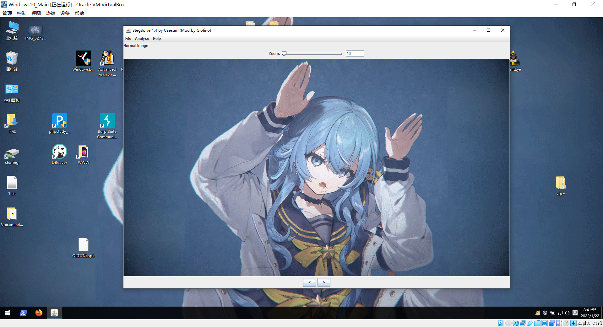
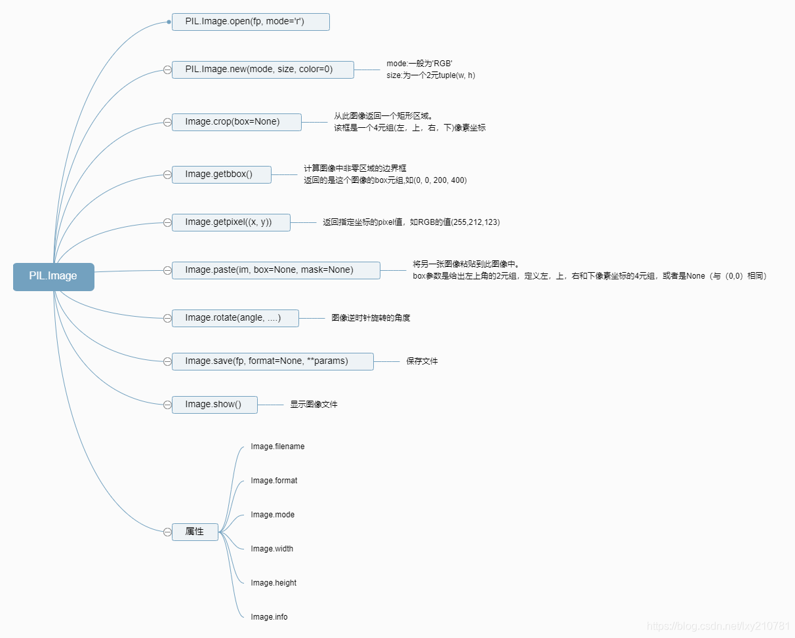

## Stegsolve

Github项目地址：https://github.com/Giotino/stegsolve

这个工具应该讲图片隐写的时候是必须讲的，因为这个工具即可以实现图片单颜色通道的可视化查看，也实现了两张图片之间的交叉比对、结构数据检查、GIF逐帧查看等等。



## pillow

Python早先版本中`PIL`库的继任者，继承了原先`PIL`库的大部分功能，并且做出了加强。

使用语句：

```python
import PIL
```



使用pillow库，可以做到逐像素生成或处理图像。

>   参考链接：https://blog.csdn.net/lxy210781/article/details/89290600

```python
from PIL import Image
MAX=500
pic = Image.new("RGB", (MAX, MAX))
# pic为新建图像对象，设置为RGB格式，大小为500x500
pic = Image.open("*.jpg")
# 载入某图像文件为图像对象
pic.putpixel([x, y], (0, 0, 0))
# 在pic的（x,y）处放置一个（0,0,0,）纯黑的像素
pic.getpixel([x, y])
# 获取pic在（x,y）处的像素值
pic.show()
```

## gnuplot数字绘图

`gnuplot`是Linux上面的工具，可以接收用户输入的坐标信息，并在坐标系中绘制出来。`gnuplot`可以使用apt快速安装：

```shell
$ gnuplot
Command 'gnuplot' not found, but can be installed with:
sudo apt install gnuplot-nox  # version 5.4.2+dfsg2-2, or
sudo apt install gnuplot-qt   # version 5.4.2+dfsg2-2
sudo apt install gnuplot-x11  # version 5.4.2+dfsg2-2
```

基础用法可见于`拼图类隐写`

## PhotoShop

Photoshop，以及同类软件（如Krita），作为万能的图像编辑工具，主要用来大块拼图的拼接，图像简单处理等领域。对于手撕的3*3的拼图有奇效（建议搭配微信扫码使用）

## zsteg

Github项目地址：https://github.com/zed-0xff/zsteg

这是一个用于检测 PNG 和 BMP 中的隐写数据的软件，用gem即可安装在Linux上。对于正常数据，zsteg很少误报，但对于LSB隐写，Openstego隐写，wbstego4等等方式的隐写数据，都有较高的识别能力。

## jphide

## imagemagick

