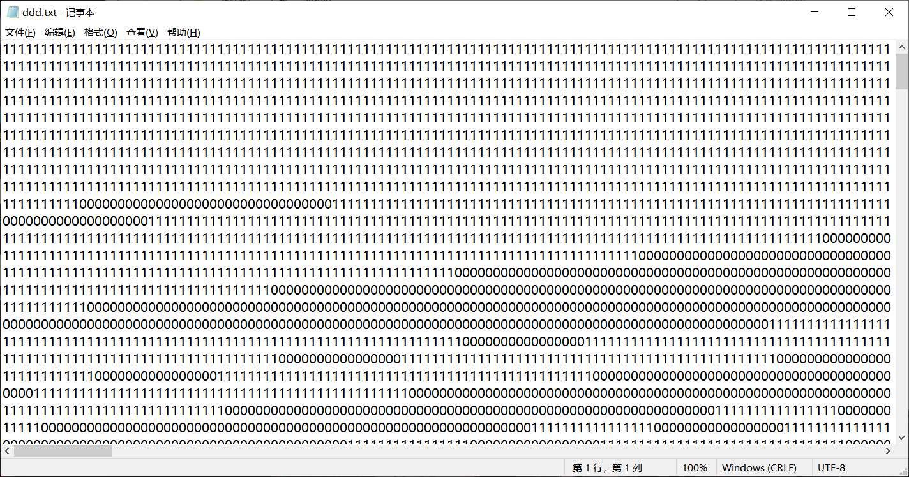
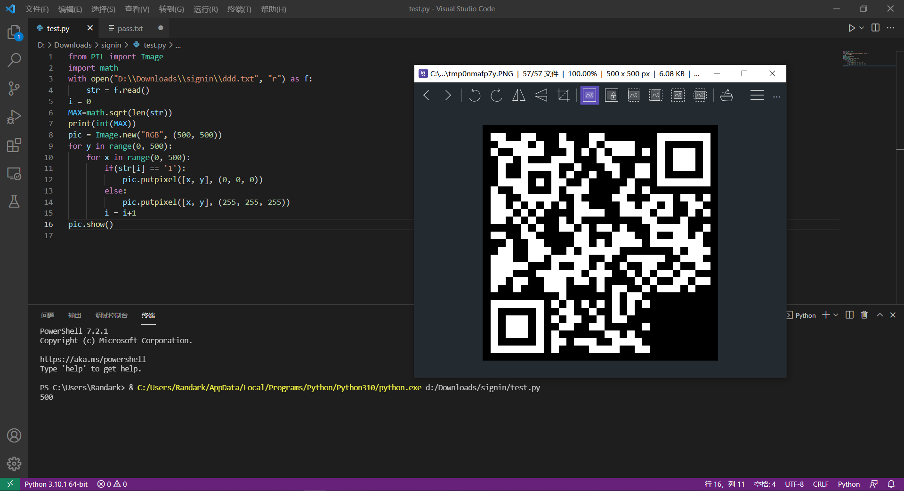
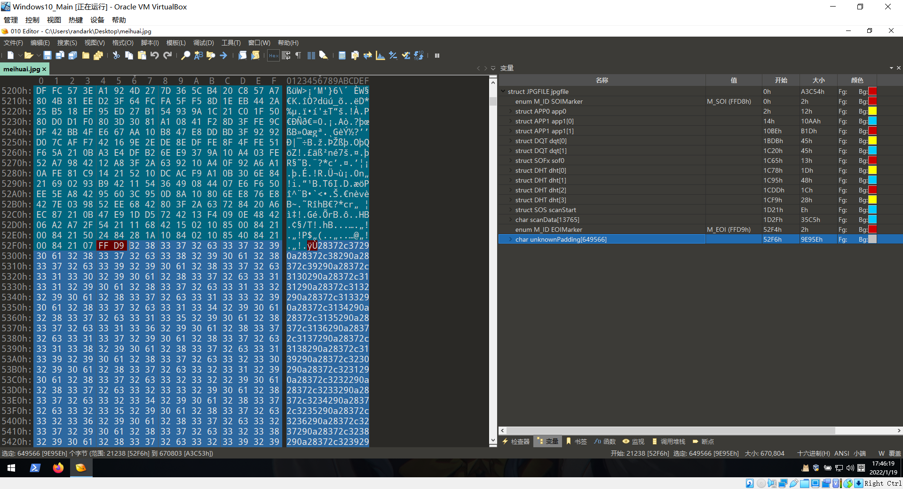
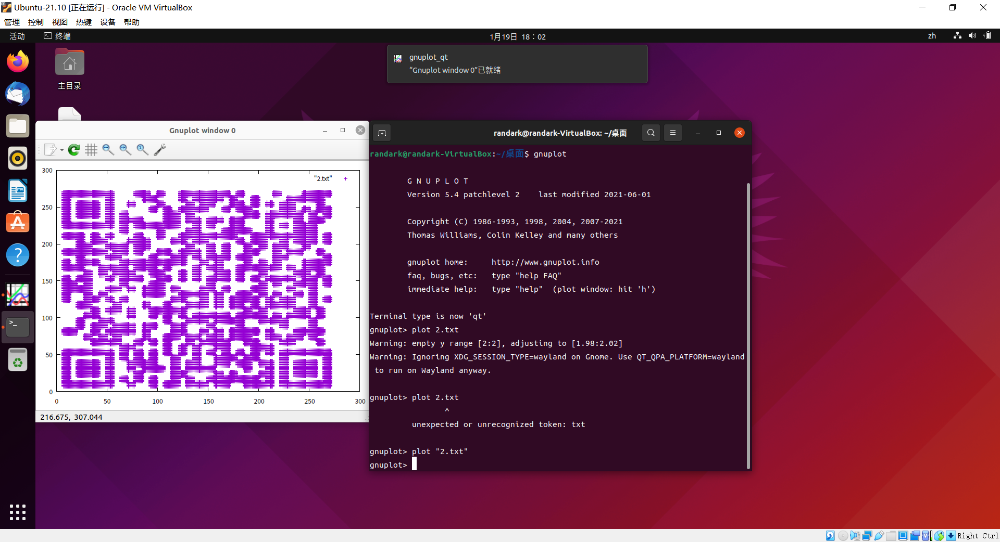

# 拼图类隐写

最简单的对半分的拼图，这里就不讲了，这里着重讲的是两种拼图类隐写以及解题用的脚本。顺便也讲一些拼接二维码的题型。

## 只给出拼图碎片，无原图信息

这个刷过BUUCTF的人应该都比较熟悉，最经典的拼图题莫过于[MRCTF2020-不眠之夜](https://buuoj.cn/challenges#[MRCTF2020]%E4%B8%8D%E7%9C%A0%E4%B9%8B%E5%A4%9C)。

首先，将会用到两个工具：

1.   montage 

`ImageMagick`是一套适用于Linux的工具，可让您从命令行操作图像。其中含有一个工具：`montage`，可以用来将多张图片合并为一张大图片。

举个例子：

```shell
montage *jpg -tile 10x12 -geometry +0+0 flag.jpg
$*jpg #指输入此目录下所有的jpg文件，可以替换为*.png之类的
$-title #设置大图片每一边由几张小图片来组成
$-geometry #设置每一张图片之间的间距
$flag.jpg #设置输出文件
```

2.   gaps 

https://github.com/nemanja-m/gaps，基于遗传算法的拼图求解器，具有块大小自动检测功能。 	用于自动化拼图。

举个例子：

```shell
gaps --image=flag.jpg --generations=40 --population=120 --size=100
$–image 指向拼图的路径
$–size 拼图块的像素尺寸
$–generations 遗传算法的代的数量
$–population 个体数量
$–verbose 每一代训练结束后展示最佳结果
$–save 将拼图还原为图像
```

就是40代的遗传算法来计算图像边界，来实现自动拼图。

首先看一下[MRCTF2020-不眠之夜](https://buuoj.cn/challenges#[MRCTF2020]%E4%B8%8D%E7%9C%A0%E4%B9%8B%E5%A4%9C)给的附件：


图片碎片大小适中，数量合理，应该是可以自动化拼图。进入Linux：

```shell
montage *jpg -tile 10x12 -geometry 200x100+0+0 flag.jpg
```

可以发现得到的`flag.jpg`是这个样子：


接下来开始计算：

```shell
gaps --image=flag.jpg --generations=40 --population=120 --size=100
```

最后将弹出窗口，展示拼好后的图片：


## 给了原图和大量切割出来的碎片

这一块内容与上面有所不同，这种情况下虽然有原图信息，但是往往给出了大量的碎片（这些碎片）

```python
#python3
from cv2 import cv2 
from PIL import Image
import os
import shutil
#读取目标图片
target = cv2.imread(r"./flag.png")

def match(temp_file):
    #读取模板图片
    template = cv2.imread(temp_file)
    #获得模板图片的高宽尺寸
    theight, twidth = template.shape[:2]
    #执行模板匹配，采用的匹配方式cv2.TM_SQDIFF_NORMED
    result = cv2.matchTemplate(target,template,cv2.TM_SQDIFF_NORMED )
    #归一化处理
    cv2.normalize( result, result, 0, 1, cv2.NORM_MINMAX, -1 )
    #寻找矩阵（一维数组当做向量，用Mat定义）中的最大值和最小值的匹配结果及其位置
    min_val, max_val, min_loc, max_loc = cv2.minMaxLoc(result)
    return abs(min_val)

dst_path=r"./flag"
dirs = os.listdir(r"./png")
count=0
for k in dirs:
    if(k.endswith('png')):
        count+=1
        print("processing on pic"+str(count))
        real_path=os.path.join(r".flag",k)
        rect=match(real_path)
        if rect>1e-10:
            print(rect)
            shutil.move(real_path,dst_path)
    else:
        continue
```

这一块的话，近一年公开CTF比赛中就出现过一次，是2021年强网杯-青少年专项。但是那一次比赛简直漏洞百出，题目最后的正确答案和选手们解出的答案也不一样，故这里就没有好的例题用来演示了。。

## 按顺序给出01，输出二维码

​	这类题目一般都是直接给`1111101010010`这样的数据，以此来表示二维码从左到右，从上至下的像素排列。对此，可以使用Python中的PIL库来进行绘图：

```python
from PIL import Image
import math
with open("test.txt", "r") as f:
    str = f.read()
i = 0
MAX=math.sqrt(len(str)) # 要求二维码是正方形
print(int(MAX))
pic = Image.new("RGB", (500, 500))
for y in range(0, 500):
    for x in range(0, 500):
        if(str[i] == '1'):
            pic.putpixel([x, y], (0, 0, 0))
        else:
            pic.putpixel([x, y], (255, 255, 255))
        i = i+1
pic.show()
```

例题：[[闽盾杯 2021]signin](https://www.ctfer.vip/#/problem/938)：

题目附件给了大量的二进制数据：



那么就用上面给出的脚本绘制一下二维码：



修复一下，就可以得到二维码。

## 给出坐标，输出二维码

​	二维码的像素坐标有可能是要去找，也有可能题目会直接提供，但是都要求选手要自己绘画出来。

例题：[梅花香自苦寒来](https://buuoj.cn/challenges#%E6%A2%85%E8%8A%B1%E9%A6%99%E4%B9%8B%E8%8B%A6%E5%AF%92%E6%9D%A5)

查看一下图片附件的十六进制数据：



将十六进制的数据转换一下：


然后坐标数据处理一下：

```python
with open("1.txt","r") as f:
    h=f.read()
tem=''
f=open("2.txt","w") 
result=""
for i in range(0,len(h),2):
    tem='0x'+h[i]+h[i+1]
    tem=int(tem,base=16)
    result+=chr(tem)
# 上面将HEX数据进行解码，得到坐标
a=result.split()
result=""
tem=''
for i in range(0,len(a)):
    tem=a[i]
    tem=tem.lstrip('(')
    tem=tem.rstrip(')')
    for j in range(0,len(tem)):
        if tem[j]==',':
            tem=tem[:j]+' '+tem[j+1:]
    result+=tem+"\n"
# 上面将“（），”三个符号删除，使bnuplotn
f.write(result)
f.close()
```

将得到的`2.txt`进入Linux，开始绘图：

```shell
$ gnuplot
> plot "2.txt"
```

即可得到：



即可得到二维码。

~~个人觉得这个题的坐标数据应该也可以用pillow输出~~