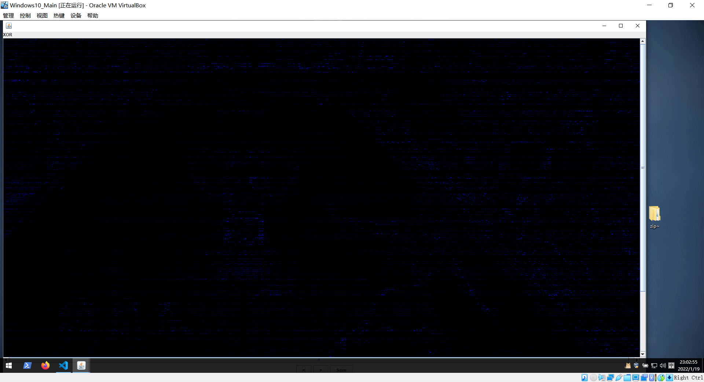
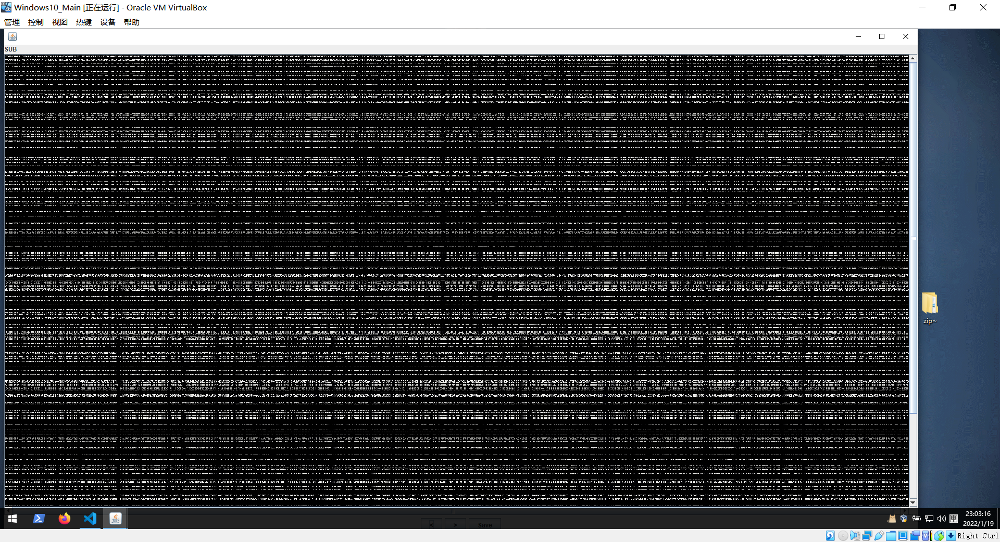
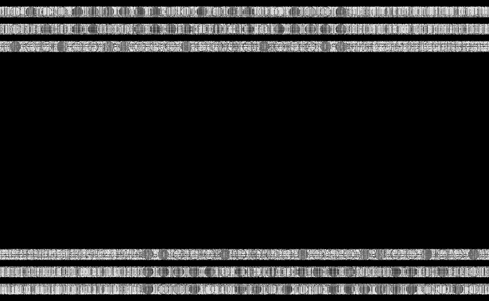
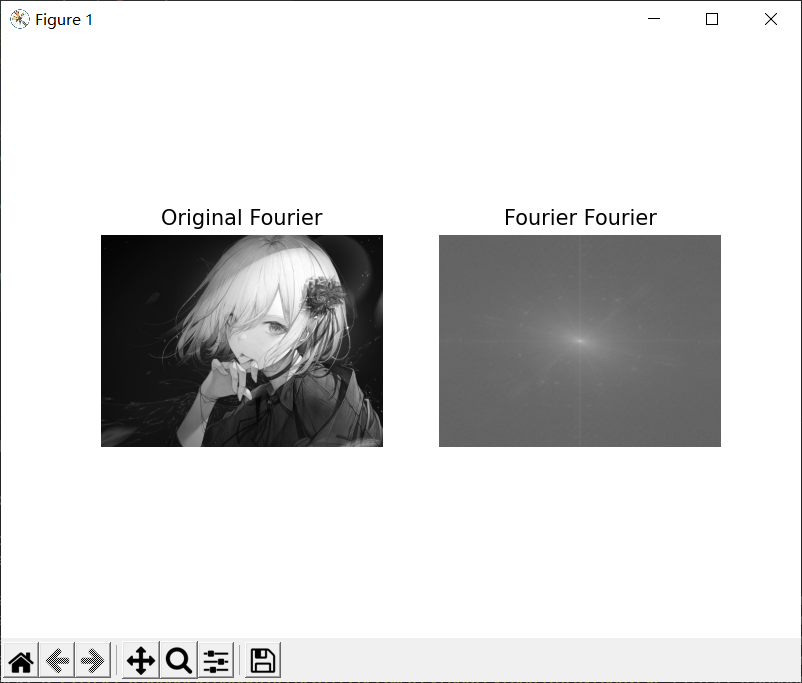
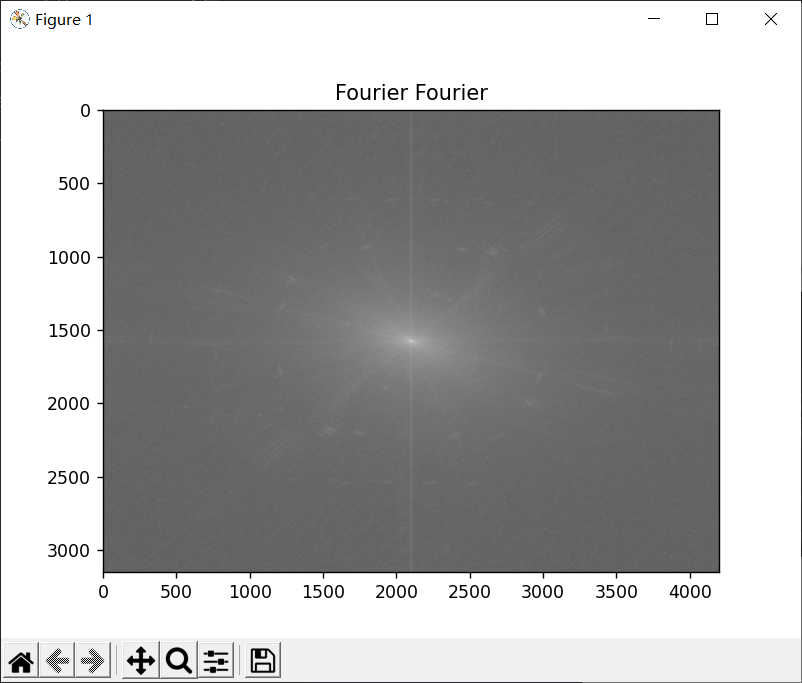

# 数字水印

数字水印目前由于在版权领域和产权鉴定十分流行，故在CTF领域也非常常见。并且由于数字水印的特征会随着水印方式和算法的差异性而不同，故这里只介绍常见的数字水印和处理方式。

盲水印分为不同的种类，其中分为两大题型，分别是给出原图和水印图，要求分离信息，还有一种就是只给出水印图，要求分离信息。这里将两大类型各举一个经典工具，并加以说明。

需要注意的是，盲水印这类加密方式，是基本不可能通过简单查看颜色通道就能发现水印信息的。能直接通过颜色通道看到水印信息的，那是LSB。

## 给出了原图和水印图

>   chishaxie/BlindWaterMark：https://github.com/chishaxie/BlindWaterMark

并不是说所有这类水印题都是这个脚本出的，但是绝大可能都是用了这个脚本。毕竟经典又好用。。

例题：[双目失明，身残志坚](https://buuoj.cn/match/matches/36/challenges#%E5%8F%8C%E7%9B%AE%E5%A4%B1%E6%98%8E%EF%BC%8C%E8%BA%AB%E6%AE%8B%E5%BF%97%E5%9D%9A)

这题就是明显的盲水印了，用`stegsolve`对两张图片进行交叉比对。不能发现有明显信息，但是存在人为的信息痕迹。





于是想到用脚本来解密：

```shell
$python .\bwmforpy3.py decode .\original.png .\blind.png out.png
# image<.\original.png> + image(encoded)<.\blind.png> -> watermark<out.png>
```

得到：



根据题意，查阅资料后可以得知，这个就是一张盲文信息，对照后即可解出flag。

## 只给了水印图

在这种情况下，基本上就要开始准备开始入手盲检测。盲检测最常用的方式，就是计算图像的一维熵，也就是图像中灰度分布的聚集特征所包含的信息量。 

>   对于图像熵的计算，可以参考这篇文章：https://blog.csdn.net/a6333230/article/details/81021922

并且给出两个比较知名的处理工具：

>    guofei9987 / blind_watermark：https://github.com/guofei9987/blind_watermark
>
>    fire-keeper / BlindWatermark ：https://github.com/fire-keeper/BlindWatermark

对此，提供以下脚本用于展示灰度分布：

```python
import cv2 as cv
import numpy as np
from matplotlib import pyplot as plt

img = cv.imread('a.png', 0)  # 读取图像
f = np.fft.fft2(img)  # 快速傅里叶变换算法得到频率分布
# 默认结果中心点位置是在左上角,
# 调用fftshift()函数转移到中间位置
fshift = np.fft.fftshift(f)
fimg = np.log(np.abs(fshift))  # fft结果是复数, 其绝对值结果是振幅
# 展示结果
plt.subplot(121), plt.imshow(img, 'gray'), plt.title('Original Fourier')
plt.axis('off')
plt.subplot(122), plt.imshow(fimg, 'gray'), plt.title('Fourier Fourier')
plt.axis('off')
plt.show()
plt.imshow(fimg, 'gray'), plt.title('Fourier Fourier')
plt.show()
```

运行脚本后，将会显示两个窗口：





清晰的展示了图像的灰度分布。

相关的检测和理论、轮子，可以参考以下文章：

>   [Opencv实现盲水印技术—傅里叶变换算法及盲水印实现](https://blog.csdn.net/chenxiao_ji/article/details/52875199)
>
>   [有意思的数字盲水印的简单的实现](https://www.cnblogs.com/Imageshop/p/10097854.html)

水印这块的信息量太大了，照抄材料也不好，灰度检测的效果也取决于水印算法和水印信息（想上面的例题，灰度检测就看不到特征，只能依靠于原图与水印图的交叉比对发现异常）。目前根据我所接触过的材料和工具来看，图片加上水印后，图片的灰度分布肯定会发生改变，但是一般的文字盲水印对于灰度分布的影响是肉眼不可见的，图片水印的话，一般的水印算法会在图片的灰度分布上做出明显改变。这就需要选手紧跟前沿研究和近几年的出题方向。

