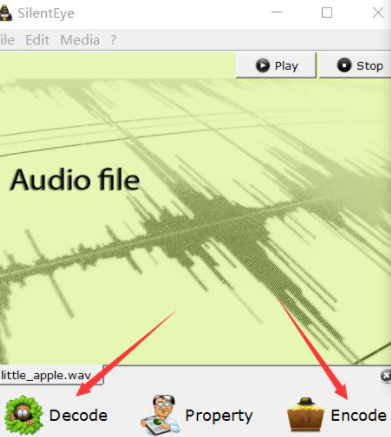

# 音频隐写概述

> 音频隐写那么多种工具，这里仅对常见的形式做出概述
> 
> ***~~音频隐写有时候又被叫做电波题，不是没有道理的~~***

音频隐写中常用的一些工具有Silenteye、Mp3stego、Audacity等工具，这就需要选手对附件的加密形式做出准确判断。

## Silenteye

Silenteye是一款可以跨平台的应用程序设计，可以使用隐写术，将消息隐藏到图片或声音中。它提供了一个很好的界面，并通过使用插件系统轻松集成了新的隐写算法和加密过程。

## MP3Stego

在压缩过程中，MP3Stego 会将信息隐藏在 MP3 文件中。数据首先被压缩、加密，然后隐藏在 MP3 比特流中。主要考察软件mp3stego的使用。

## 频谱图

主要将一些信息隐藏在音波频率中，一班=般可以查看频谱图发现一部分信息，能直接看到flag的很少见，主要使用Audacity工具即可，难度不大。主要考察WAV 音频文件隐写术和Audacity的基础使用。
