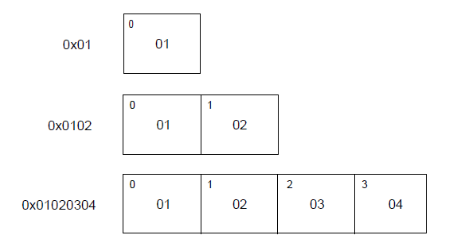

# 文件格式

这一块主要用于对程序进行逆向分析时，定位出程序的基本信息，如是32位程序还是64位程序、软件是运行在哪个平台的，对这个程序应该用哪些工具来处理，等等。

对于这类信息，可以考虑使用`010 Editor`的模板功能进行自动识别：


或者使用Die工具进行查看：


## 一、ELF文件

ELF （Executable and Linkable Format）文件，也就是在 Linux 中的目标文件，主要有以下三种类型

-   可重定位文件（Relocatable File），包含由编译器生成的代码以及数据。链接器会将它与其它目标文件链接起来从而创建可执行文件或者共享目标文件。在 Linux 系统中，这种文件的后缀一般为 `.o` 。
-   可执行文件（Executable File），就是我们通常在 Linux 中执行的程序。
-   共享目标文件（Shared Object File），包含代码和数据，这种文件是我们所称的库文件，一般以 `.so` 结尾。一般情况下，它有以下两种使用情景：
    -   链接器（Link eDitor, ld）可能会处理它和其它可重定位文件以及共享目标文件，生成另外一个目标文件。
    -   动态链接器（Dynamic Linker）将它与可执行文件以及其它共享目标组合在一起生成进程镜像。

>   关于 Link eDitor 的命名，https://en.wikipedia.org/wiki/GNU_linker

目标文件由汇编器和链接器创建，是文本程序的二进制形式，可以直接在处理器上运行。那些需要虚拟机才能够执行的程序 (Java) 不属于这一范围。

>   内容参考自：CTF Wiki-ELF 文件基本结构 	https://ctf-wiki.org/executable/elf/structure/basic-info/

|          Linking View           |         Execution View          |
| :-----------------------------: | :-----------------------------: |
|           ELF Header            |           ELF Header            |
| Program Header Table *optional* |      Program Header Table       |
|            Section 1            |            Segment 1            |
|              …………               |                                 |
|            Sectin n             |            Segment 2            |
|              …………               |                                 |
|              …………               |                                 |
|      Section Header Table       | Section Header Table *optional* |

首先，我们来**关注一下链接视图**。

文件开始处是 ELF 头部（ **ELF Header**），它给出了整个文件的组织情况。

如果程序头部表（Program Header Table）存在的话，它会告诉系统如何创建进程。用于生成进程的目标文件必须具有程序头部表，但是重定位文件不需要这个表。

节区部分包含在链接视图中要使用的大部分信息：指令、数据、符号表、重定位信息等等。

节区头部表（Section Header Table）包含了描述文件节区的信息，每个节区在表中都有一个表项，会给出节区名称、节区大小等信息。用于链接的目标文件必须有节区头部表，其它目标文件则无所谓，可以有，也可以没有。

对于**执行视图**来说，其主要的不同点在于没有了 section，而有了多个 segment。其实这里的 segment 大都是来源于链接视图中的 section。

**注意:**尽管图中是按照 ELF 头，程序头部表，节区，节区头部表的顺序排列的。但实际上除了 ELF 头部表以外，其它部分都没有严格的顺序。

### 数据形式

ELF 文件格式支持 8 位 / 32  位体系结构。当然，这种格式是可以扩展的，也可以支持更小的或者更大位数的处理器架构。因此，目标文件会包含一些控制数据，这部分数据表明了目标文件所使用的架构，这也使得它可以被通用的方式来识别和解释。目标文件中的其它数据采用目的处理器的格式进行编码，与在何种机器上创建没有关系。这里其实想表明的意思目标文件可以进行交叉编译，我们可以在 x86 平台生成 arm 平台的可执行代码。

目标文件中的所有数据结构都遵从 “自然” 大小和对齐规则。如下

| 名称          | 长度 | 对齐方式 | 用途           |
| ------------- | ---- | -------- | -------------- |
| Elf32_Addr    | 4    | 4        | 无符号程序地址 |
| Elf32_Half    | 2    | 2        | 无符号半整型   |
| Elf32_Off     | 4    | 4        | 无符号文件偏移 |
| Elf32_Sword   | 4    | 4        | 有符号大整型   |
| Elf32_Word    | 4    | 4        | 无符号大整型   |
| unsigned char | 1    | 1        | 无符号小整型   |

如果必要，数据结构可以包含显式地补齐来确保 4 字节对象按 4 字节对齐，强制数据结构的大小是 4 的整数倍等等。数据同样适用是对齐的。因此，包含一个 Elf32_Addr 类型成员的结构体会在文件中的 4 字节边界处对齐。

为了具有可移植性，ELF 文件不使用位域。

### 0x01 ELF Header

ELF Header 描述了 ELF 文件的概要信息，利用这个数据结构可以索引到 ELF 文件的全部信息。

结构如下：

```c
#define EI_NIDENT   16

typedef struct {
    unsigned char   e_ident[EI_NIDENT];
    ELF32_Half      e_type;
    ELF32_Half      e_machine;
    ELF32_Word      e_version;
    ELF32_Addr      e_entry;
    ELF32_Off       e_phoff;
    ELF32_Off       e_shoff;
    ELF32_Word      e_flags;
    ELF32_Half      e_ehsize;
    ELF32_Half      e_phentsize;
    ELF32_Half      e_phnum;
    ELF32_Half      e_shentsize;
    ELF32_Half      e_shnum;
    ELF32_Half      e_shstrndx;
} Elf32_Ehdr;
```

其中每个成员都是 e 开头的，它们应该都是 ELF 的缩写。每个成员具体的说明如下。

#### 1. e_ident

正如之前所说，ELF 提供了一个目标文件框架，以便于支持多种处理器，多种编码格式的机器。该变量给出了用于解码和解释文件中与机器无关的数据的方式。这个数组对于不同的下标的含义如下

| 宏名称     | 下标 | 目的           |
| ---------- | ---- | -------------- |
| EI_MAG0    | 0    | 文件标识       |
| EI_MAG1    | 1    | 文件标识       |
| EI_MAG2    | 2    | 文件标识       |
| EI_MAG3    | 3    | 文件标识       |
| EI_CLASS   | 4    | 文件类         |
| EI_DATA    | 5    | 数据编码       |
| EI_VERSION | 6    | 文件版本       |
| EI_PAD     | 7    | 补齐字节开始处 |

其中，

`e_ident[EI_MAG0]` 到 `e_ident[EI_MAG3]`，即文件的头 4 个字节，被称作 “魔数”，标识该文件是一个 ELF 目标文件。**至于开头为什么是 0x7f，并没有仔细去查过**。

| 名称    | 值   | 位置             |
| ------- | ---- | ---------------- |
| ELFMAG0 | 0x7f | e_ident[EI_MAG0] |
| ELFMAG1 | ‘E’  | e_ident[EI_MAG1] |
| ELFMAG2 | ‘L’  | e_ident[EI_MAG2] |
| ELFMAG3 | ‘F’  | e_ident[EI_MAG3] |

`e_ident[EI_CLASS]` 为 `e_ident[EI_MAG3]`的下一个字节，标识文件的类型或容量。

| 名称         | 值   | 意义      |
| ------------ | ---- | --------- |
| ELFCLASSNONE | 0    | 无效类型  |
| ELFCLASS32   | 1    | 32 位文件 |
| ELFCLASS64   | 2    | 64 位文件 |

ELF 文件的设计使得它可以在多种字节长度的机器之间移植，而不需要强制规定机器的最长字节长度和最短字节长度。`ELFCLASS32`类型支持文件大小和虚拟地址空间上限为 4GB 的机器；它使用上述定义中的基本类型。

`ELFCLASS64` 类型用于 64 位架构。

`e_ident[EI_DATA]`字节给出了目标文件中的特定处理器数据的编码方式。下面是目前已定义的编码：

| 名称        | 值   | 意义         |
| ----------- | ---- | ------------ |
| ELFDATANONE | 0    | 无效数据编码 |
| ELFDATA2LSB | 1    | 小端         |
| ELFDATA2MSB | 2    | 大端         |

其它值被保留，在未来必要时将被赋予新的编码。

文件数据编码方式表明了文件内容的解析方式。正如之前所述，`ELFCLASS32`类型文件使用了具有 1，2 和 4 字节的变量类型。对于已定义的不同的编码方式，其表示如下所示，其中字节号在左上角。

`ELFDATA2LSB`编码使用补码，最低有效位（Least Significant Byte）占用最低地址。


`ELFDATA2MSB`编码使用补码，最高有效位（Most Significant Byte）占用最低地址。



`e_ident[EI_DATA]` 给出了 ELF 头的版本号。目前这个值必须是`EV_CURRENT`，即之前已经给出的`e_version`。

`e_ident[EI_PAD]` 给出了 `e_ident` 中未使用字节的开始地址。这些字节被保留并置为 0；处理目标文件的程序应该忽略它们。如果之后这些字节被使用，EI_PAD 的值就会改变。

#### 2. e_type

`e_type` 标识目标文件类型。

| 名称      | 值     | 意义           |
| --------- | ------ | -------------- |
| ET_NONE   | 0      | 无文件类型     |
| ET_REL    | 1      | 可重定位文件   |
| ET_EXEC   | 2      | 可执行文件     |
| ET_DYN    | 3      | 共享目标文件   |
| ET_CORE   | 4      | 核心转储文件   |
| ET_LOPROC | 0xff00 | 处理器指定下限 |
| ET_HIPROC | 0xffff | 处理器指定上限 |

虽然核心转储文件的内容没有被详细说明，但 `ET_CORE` 还是被保留用于标志此类文件。从 `ET_LOPROC` 到 `ET_HIPROC` (包括边界) 被保留用于处理器指定的场景。其它值在未来必要时可被赋予新的目标文件类型。

#### 3. e_machine

这一项指定了当前文件可以运行的机器架构。

| 名称     | 值   | 意义           |
| -------- | ---- | -------------- |
| EM_NONE  | 0    | 无机器类型     |
| EM_M32   | 1    | AT&T WE 32100  |
| EM_SPARC | 2    | SPARC          |
| EM_386   | 3    | Intel 80386    |
| EM_68K   | 4    | Motorola 68000 |
| EM_88K   | 5    | Motorola 88000 |
| EM_860   | 7    | Intel 80860    |
| EM_MIPS  | 8    | MIPS RS3000    |

其中 EM 应该是 `ELF Machine` 的简写。

其它值被在未来必要时用于新的机器。 此外，特定处理器的 ELF 名称使用机器名称来进行区分，一般标志会有个前缀`EF_` （ELF Flag）。例如，在`EM_XYZ`机器上名叫 `WIDGET` 的标志将被称为 `EF_XYZ_WIDGET`。

####  4. e_version

标识目标文件的版本。

| 名称       | 值   | 意义     |
| ---------- | ---- | -------- |
| EV_NONE    | 0    | 无效版本 |
| EV_CURRENT | 1    | 当前版本 |

1 表示初始文件格式；未来扩展新的版本的时候 (extensions) 将使用更大的数字。虽然在上面值`EV_CURRENT`为 1，但是为了反映当前版本号，它可能会改变，**比如 ELF 到现在也就是 1.2 版本。**

####  5. e_entry

这一项为系统转交控制权给 ELF 中相应代码的虚拟地址。如果没有相关的入口项，则这一项为 0。

####  6. e_phoff

这一项给出**程序头部表**在文件中的字节偏移（**Program Header table OFFset**）。如果文件中没有程序头部表，则为 0。

####  7. e_shoff

这一项给出**节头表**在文件中的字节偏移（ **Section Header table OFFset** ）。如果文件中没有节头表，则为 0。

####  8. e_flags

这一项给出文件中与特定处理器相关的标志，这些标志命名格式为`EF_machine_flag`。

####  9. e_ehsize

这一项给出 ELF 文件头部的字节长度（ELF Header Size）。

####  10. e_phentsize

这一项给出程序头部表中每个表项的字节长度（**Program Header ENTry SIZE**）。每个表项的大小相同。

####  11. e_phnum

这一项给出程序头部表的项数（ **Program Header entry NUMber** ）。因此，`e_phnum` 与 `e_phentsize` 的乘积即为程序头部表的字节长度。如果文件中没有程序头部表，则该项值为 0。

####  12. e_shentsize

这一项给出节头的字节长度（**Section Header ENTry SIZE**）。一个节头是节头表中的一项；节头表中所有项占据的空间大小相同。

####  13. e_shnum

这一项给出节头表中的项数（**Section Header NUMber**）。因此， `e_shnum` 与 `e_shentsize` 的乘积即为节头表的字节长度。如果文件中没有节头表，则该项值为 0。

####  14. e_shstrndx

这一项给出节头表中与节名字符串表相关的表项的索引值（**Section Header table InDeX related with section name STRing table**）。如果文件中没有节名字符串表，则该项值为`SHN_UNDEF`。关于细节的介绍，请参考后面的 “节” 和“字符串表”部分。

### 0x02 Program Header Table

Program Header Table 是一个结构体数组，每一个元素的类型是 `Elf32_Phdr`，描述了一个段或者其它系统在准备程序执行时所需要的信息。其中，ELF 头中的 `e_phentsize` 和 `e_phnum` 指定了该数组每个元素的大小以及元素个数。一个目标文件的段包含一个或者多个节。**程序的头部只有对于可执行文件和共享目标文件有意义。**

可以说，Program Header Table 就是专门为 ELF 文件运行时中的段所准备的。

`Elf32_Phdr` 的数据结构如下

```
typedef struct {
    ELF32_Word  p_type;
    ELF32_Off   p_offset;
    ELF32_Addr  p_vaddr;
    ELF32_Addr  p_paddr;
    ELF32_Word  p_filesz;
    ELF32_Word  p_memsz;
    ELF32_Word  p_flags;
    ELF32_Word  p_align;
} Elf32_Phdr;
```

#### 1. p_type

该字段为段的类型，或者表明了该结构的相关信息。

可执行文件中的段类型如下

| 名字                | 取值                   | 说明                                                         |
| ------------------- | ---------------------- | ------------------------------------------------------------ |
| PT_NULL             | 0                      | 表明段未使用，其结构中其他成员都是未定义的。                 |
| PT_LOAD             | 1                      | 此类型段为一个可加载的段，大小由 p_filesz 和 p_memsz 描述。文件中的字节被映射到相应内存段开始处。如果 p_memsz 大于 p_filesz，“剩余” 的字节都要被置为 0。p_filesz 不能大于 p_memsz。可加载的段在程序头部中按照 p_vaddr  的升序排列。 |
| PT_DYNAMIC          | 2                      | 此类型段给出动态链接信息。                                   |
| PT_INTERP           | 3                      | 此类型段给出了一个以 NULL 结尾的字符串的位置和长度，该字符串将被当作解释器调用。这种段类型仅对可执行文件有意义（也可能出现在共享目标文件中）。此外，这种段在一个文件中最多出现一次。而且这种类型的段存在的话，它必须在所有可加载段项的前面。 |
| PT_NOTE             | 4                      | 此类型段给出附加信息的位置和大小。                           |
| PT_SHLIB            | 5                      | 该段类型被保留，不过语义未指定。而且，包含这种类型的段的程序不符合 ABI 标准。 |
| PT_PHDR             | 6                      | 该段类型的数组元素如果存在的话，则给出了程序头部表自身的大小和位置，既包括在文件中也包括在内存中的信息。此类型的段在文件中最多出现一次。**此外，只有程序头部表是程序的内存映像的一部分时，它才会出现**。如果此类型段存在，则必须在所有可加载段项目的前面。 |
| PT_LOPROC~PT_HIPROC | 0x70000000 ~0x7fffffff | 此范围的类型保留给处理器专用语义。                           |

#### 2. p_offset

该字段给出了从文件开始到该段开头的第一个字节的偏移。

#### 3. p_vaddr 	

该字段给出了该段第一个字节在内存中的虚拟地址。

程序头部的虚拟地址可能并不是程序内存镜像中实际的虚拟地址。通常来说，可执行程序都会包含绝对地址的代码。为了使得程序可以正常执行，段必须在相应的虚拟地址处。另一方面，共享目标文件通常来说包含与地址无关的代码。这可以使得共享目标文件可以被多个进程加载，同时保持程序执行的正确性。尽管系统会为不同的进程选择不同的虚拟地址，但是它仍然保留段的相对地址，**因为地址无关代码使用段之间的相对地址来进行寻址，内存中的虚拟地址之间的差必须与文件中的虚拟地址之间的差相匹配**。内存中任何段的虚拟地址与文件中对应的虚拟地址之间的差值对于任何一个可执行文件或共享对象来说是一个单一常量值。这个差值就是基地址，基地址的一个用途就是在动态链接期间重新定位程序。

可执行文件或者共享目标文件的基地址是在执行过程中由以下三个数值计算的

-   虚拟内存加载地址
-   最大页面大小
-   程序可加载段的最低虚拟地址

要计算基地址，首先要确定可加载段中 p_vaddr 最小的内存虚拟地址，之后把该内存虚拟地址缩小为与之最近的最大页面的整数倍即是基地址。根据要加载到内存中的文件的类型，内存地址可能与 p_vaddr 相同也可能不同。

#### 4. p_paddr 	

该字段仅用于物理地址寻址相关的系统中， 由于 “System V” 忽略了应用程序的物理寻址，可执行文件和共享目标文件的该项内容并未被限定。

#### 5.p_filesz 	

该字段给出了文件镜像中该段的大小，可能为 0。

#### 6. p_memsz 	

该字段给出了内存镜像中该段的大小，可能为 0。

#### 7. p_flags 	

该字段给出了与段相关的标记。

被系统加载到内存中的程序至少有一个可加载的段。当系统为可加载的段创建内存镜像时，它会按照 p_flags 将段设置为对应的权限。可能的段权限位有：

|    Name     |   Value    |   Meaning   |
| :---------: | :--------: | :---------: |
|    PF_X     |    0x1     |   Execute   |
|    PF_W     |    0x2     |    Write    |
|    PF_R     |    0x4     |    Read     |
| PF_MASKPROC | 0xf0000000 | Unspecified |

其中，所有在 PF_MASKPROC 中的比特位都是被保留用于与处理器相关的语义信息。

如果一个权限位被设置为 0，这种类型的段是不可访问的。实际的内存权限取决于相应的内存管理单元，不同的系统可能操作方式不一样。尽管所有的权限组合都是可以的，但是系统一般会授予比请求更多的权限。在任何情况下，除非明确说明，一个段不会有写权限。

#### 8. p_align 	

可加载的程序的段的 p_vaddr 以及 p_offset 的大小必须是 page 的整数倍。该成员给出了段在文件以及内存中的对齐方式。如果该#### 9. 值为 0 或 1 的话，表示不需要对齐。除此之外，p_align 应该是 2 的整数指数次方，并且 p_vaddr 与 p_offset 在模 p_align 的意义下，应该相等。

例如，一般来说，.text 段一般具有读和执行权限，但是不会有写权限。数据段一般具有写，读，以及执行权限。

### 0x03 Section Header Table

其实这个数据结构是在 ELF 文件的尾部，但是为了讲解方便，这里将这个表放在这里进行讲解。

该结构用于定位 ELF 文件中的每个节区的具体位置。

首先，ELF 头中的 `e_shoff` 项给出了从文件开头到节头表位置的字节偏移。`e_shnum` 告诉了我们节头表包含的项数；`e_shentsize` 给出了每一项的字节大小。

其次，节头表是一个数组，每个数组的元素的类型是 `ELF32_Shdr` ，每一个元素都描述了一个节区的概要内容。

每个节区头部可以用下面的数据结构进行描述：

```c
typedef struct {
    ELF32_Word      sh_name;
    ELF32_Word      sh_type;
    ELF32_Word      sh_flags;
    ELF32_Addr      sh_addr;
    ELF32_Off       sh_offset;
    ELF32_Word      sh_size;
    ELF32_Word      sh_link;
    ELF32_Word      sh_info;
    ELF32_Word      sh_addralign;
    ELF32_Word      sh_entsize;
} Elf32_Shdr;
```

每个字段的含义如下

| 成员         | 说明                                                         |
| ------------ | ------------------------------------------------------------ |
| sh_name      | 节名称，是节区头字符串表节区中（Section Header String Table Section）的索引，因此该字段实际是一个数值。在字符串表中的具体内容是以 NULL 结尾的字符串。 |
| sh_type      | 根据节的内容和语义进行分类，具体的类型下面会介绍。           |
| sh_flags     | 每一比特代表不同的标志，描述节是否可写，可执行，需要分配内存等属性。 |
| sh_addr      | 如果节区将出现在进程的内存映像中，此成员给出节区的第一个字节应该在进程镜像中的位置。否则，此字段为 0。 |
| sh_offset    | 给出节区的第一个字节与文件开始处之间的偏移。SHT_NOBITS 类型的节区不占用文件的空间，因此其 sh_offset 成员给出的是概念性的偏移。 |
| sh_size      | 此成员给出节区的字节大小。除非节区的类型是 SHT_NOBITS ，否则该节占用文件中的 sh_size 字节。类型为 SHT_NOBITS 的节区长度可能非零，不过却不占用文件中的空间。 |
| sh_link      | 此成员给出节区头部表索引链接，其具体的解释依赖于节区类型。   |
| sh_info      | 此成员给出附加信息，其解释依赖于节区类型。                   |
| sh_addralign | 某些节区的地址需要对齐。例如，如果一个节区有一个 doubleword 类型的变量，那么系统必须保证整个节区按双字对齐。也就是说，sh_addr%sh_addralign=0。目前它仅允许为 0，以及 2 的正整数幂数。 0 和 1 表示没有对齐约束。 |
| sh_entsize   | 某些节区中存在具有固定大小的表项的表，如符号表。对于这类节区，该成员给出每个表项的字节大小。反之，此成员取值为 0。 |

正如之前所说，索引为零（SHN_UNDEF）的节区头也存在，此索引标记的是未定义的节区引用。

## 二、PE文件

PE 文件的全称是 `Portable Executable` ，意为可移植的可执行的文件，常见的 EXE、DLL、OCX、SYS、COM 都是 PE 文件，PE 文件是微软 Windows 操作系统上的程序文件，可能是间接被执行，如 DLL）。 

>   内容参考自：CTF Wiki-PE 文件格式	https://ctf-wiki.org/executable/pe/pe-excutable

一个 32-bits 的 PE 文件布局如下图所示：

|       MS-DOS MZ header        | \                   |
| :---------------------------: | ------------------- |
| MS-DOS Real-Mode Stub program | \|                  |
|         PE Signature          | \|                  |
|       IMAGE_FILE_HEADER       | \|-> PE file header |
|     IMAGE_OPTIONAL_HEADER     | \|                  |
|       section header #1       | \|                  |
|       section header #2       | /                   |
|            ………………             |                     |
|          section #1           |                     |
|          section #2           |                     |
|            ………………             |                     |

### 0x01 PE 文件头

PE 文件的最开始便是 PE 文件头，它由 `MS-DOS 文件头` 和 `IMAGE_NT_HEADERS` 结构体组成。

#### 1. MS-DOS 文件头

`MS-DOS 文件头` 包含 `IMAGE_DOS_HEADER` 和 `DOS Stub` 两个部分。

`IMAGE_DOS_HEADER` 结构体中有 2 个重要成员： 

- **`e_magic` 单字。DOS 签名 "4D5A"，即 ASCII 值 "MZ"。所有 PE 文件的开头都有 DOS 签名。**

- **`e_lfanew` 单字。**

  **`IMAGE_NT_HEADER`相对于文件起始处的偏移。**

`IMAGE_DOS_HEADER` 结构体后紧接着是 `DOS Stub`，它的作用很简单，当系统为 MS-DOS 环境时，输出 `This program cannot be run in DOS mode.` 并退出程序，表明该程序不能在 MS-DOS 环境下运行。这使得所有的 PE 文件都对 MS-DOS 环境兼容。利用该特性可以创建出一个在  MS-DOS 和 Windows 环境中都能运行的程序，在 MS-DOS 中执行 16-bit MS-DOS 代码，在 Windows 中执行  32-bit Windows 代码。

#### 2. IMAGE_NT_HEADERS

`IMAGE_NT_HEADERS` 结构体，俗称 NT 头。紧跟在 `DOS Stub` 之后，其定义如下：

```
typedef struct _IMAGE_NT_HEADERS {
  DWORD                   Signature;         /* +0000h PE 标识 */
  IMAGE_FILE_HEADER       FileHeader;        /* +0004h PE 标准头 */
  IMAGE_OPTIONAL_HEADER32 OptionalHeader;    /* +0018h PE 可选头  */
} IMAGE_NT_HEADERS32, *PIMAGE_NT_HEADERS32;
```

NT头主要有三大部分：

##### PE Signature

NT 头的第一个成员是`PE Signature`，它是一个 4 字节大小的 ASCII 码字符串 `PE\0\0`，用于指明当前文件是一个 PE 格式的映像文件。其位置可以通过 `IMAGE_DOS_HEADER` 的 `e_lfanew` 成员的值确定。

##### IMAGE_FILE_HEADER

`PE Signature` 后紧跟着是 `IMAGE_FILE_HEADER` 结构体，又称作 `COFF 头（标准通用文件格式头）`。其定义如下：

```
typedef struct _IMAGE_FILE_HEADER {
  WORD  Machine;                    /* +0004h 目标机器类型 */
  WORD  NumberOfSections;           /* +0006h PE 中节的数量 */
  DWORD TimeDateStamp;              /* +0008h 时间戳 */
  DWORD PointerToSymbolTable;       /* +000ch 指向符号表的指针 */
  DWORD NumberOfSymbols;            /* +0010h 符号表中符号数目 */
  WORD  SizeOfOptionalHeader;       /* +0012h 可选头的大小 */
  WORD  Characteristics;            /* +0014h 文件属性标志 */
} IMAGE_FILE_HEADER, *PIMAGE_FILE_HEADER;
```

接下来依次对每一个字段做出解释：

- **`Machine` 单字。用于指明 CPU 类型。详细了解所支持的 CPU 类型请参考 [微软 PE 格式 COFF 文件头 Machine 类型](https://docs.microsoft.com/zh-cn/windows/win32/debug/pe-format?redirectedfrom=MSDN#machine-types)。**
- **`NumberOfSections` 单字。文件中存在的节区数量。PE 文件将代码、数据、资源的依据属性分类到不同节区中存储。**
- `TimeDateStamp` 双字。低 32 位表示从 1970 年 1 月 1 日 00：00 到文件创建时经过的秒数。
- `PointerToSymbolTable` 双字。符号表的文件偏移。如果不存在符号表，其值为 0。
- `NumberOfSymbols` 双字。该字段表示符号表中的符号数量。由于字符串表紧跟在符号表之后，所有能通过该值定位字符串表。
- **`SizeOfOptionalHeader` 单字。表示可选头的大小。在 32-bit 机器上默认是 0x00E0，在 64-bit 机器上默认是 0x00F0。**
- **`Characteristics` 单字。用于标识文件属性，以 bit OR 方式组合。**下面是一些已定义的文件属性标志：

```
// 文件属性标志
#define IMAGE_FILE_RELOCS_STRIPPED          0x0001    // 表示文件不包含重定位信息，只能在原定的基址加载。如果原定基址不可用，加载器会报出错误
#define IMAGE_FILE_EXECUTABLE_IMAGE         0x0002    // 表示文件可执行，如果该位未设置，意味着存在链接器错误
#define IMAGE_FILE_LINE_NUMS_STRIPPED       0x0004    // 不存在行信息
#define IMAGE_FILE_LOCAL_SYMS_STRIPPED      0x0008    // 不存在符号信息
#define IMAGE_FILE_AGGRESSIVE_WS_TRIM       0x0010    // 已废弃
#define IMAGE_FILE_LARGE_ADDRESS_AWARE      0x0020    // 应用可处理大于 2GB 的地址
#define IMAGE_FILE_BYTES_REVERSED_LO        0x0080    // 小尾存储。已废弃
#define IMAGE_FILE_32BIT_MACHINE            0x0100    // 基于 32-bit 体系结构
#define IMAGE_FILE_DEBUG_STRIPPED           0x0200    // 不存在调试信息
#define IMAGE_FILE_REMOVABLE_RUN_FROM_SWAP  0x0400    // 如果映像文件在可移动介质上，完全加载并复制到内存交换文件中
#define IMAGE_FILE_NET_RUN_FROM_SWAP        0x0800    // 如果映像文件在网络介质上，完全加载并复制到内存交换文件中
#define IMAGE_FILE_SYSTEM                   0x1000    // 映像文件是系统文件
#define IMAGE_FILE_DLL                      0x2000    // 映像文件是动态链接库文件
#define IMAGE_FILE_UP_SYSTEM_ONLY           0x4000    // 文件只能在单处理器机器上运行
#define IMAGE_FILE_BYTES_REVERSED_HI        0x8000    // 大尾存储（已废弃）
```

##### IMAGE_OPTIONAL_HEADER[¶](https://ctf-wiki.org/executable/pe/pe-excutable/#image_optional_header)

之所以`IMAGE_OPTIONAL_HEADER` 叫做可选头，是因为对于目标文件，它没有任何作用，只是平白增加了目标文件的大小；但对于映像文件来说，它提供了加载时必需的信息。定义如下：

```
typedef struct _IMAGE_OPTIONAL_HEADER {
  WORD                 Magic;                            /* +0018h 魔数 */
  BYTE                 MajorLinkerVersion;               /* +001ah 链接器主要版本号 */
  BYTE                 MinorLinkerVersion;               /* +001bh 链接器次要版本号 */
  DWORD                SizeOfCode;                       /* +001ch 所有含代码的节的总大小 */
  DWORD                SizeOfInitializedData;            /* +0020h 所有含已初始化数据的节的总大小 */
  DWORD                SizeOfUninitializedData;          /* +0024h 所有含未初始化数据的节的总大小 */
  DWORD                AddressOfEntryPoint;              /* +0028h 程序入口点RVA */
  DWORD                BaseOfCode;                       /* +002ch 代码节起始RVA */
  DWORD                BaseOfData;                       /* +0030h 数据节起始RVA */
  DWORD                ImageBase;                        /* +0034h 映像文件加载时的首选地址 */
  DWORD                SectionAlignment;                 /* +0038h 内存中节对齐粒度*/
  DWORD                FileAlignment;                    /* +003ch 文件中节对齐粒度 */
  WORD                 MajorOperatingSystemVersion;      /* +0040h 操作系统主要版本号 */
  WORD                 MinorOperatingSystemVersion;      /* +0042h 操作系统次要版本号 */
  WORD                 MajorImageVersion;                /* +0044h 映像文件主要版本号 */
  WORD                 MinorImageVersion;                /* +0046h 映像文件次要版本号 */
  WORD                 MajorSubsystemVersion;            /* +0048h 子系统主要版本号 */
  WORD                 MinorSubsystemVersion;            /* +004ah 子系统次要版本号 */
  DWORD                Win32VersionValue;                /* +004ch 保留。置0 */
  DWORD                SizeOfImage;                      /* +0050h 内存中映像文件的大小 */
  DWORD                SizeOfHeaders;                    /* +0054h 所有头+节表大小 */
  DWORD                CheckSum;                         /* +0058h 映像文件校验和 */
  WORD                 Subsystem;                        /* +005ch 运行映像所需子系统 */
  WORD                 DllCharacteristics;               /* +005eh 映像文件的DLL属性 */
  DWORD                SizeOfStackReserve;               /* +0060h 初始化时的保留的栈大小 */
  DWORD                SizeOfStackCommit;                /* +0064h 初始化时实际提交的栈大小 */
  DWORD                SizeOfHeapReserve;                /* +0068h 初始化时保留的堆大小 */
  DWORD                SizeOfHeapCommit;                 /* +006ch 初始化时实际提交的堆大小 */
  DWORD                LoaderFlags;                      /* +0070h 已废弃 */
  DWORD                NumberOfRvaAndSizes;              /* +0074h 数据目录结构的数量 */
  IMAGE_DATA_DIRECTORY DataDirectory[IMAGE_NUMBEROF_DIRECTORY_ENTRIES];     /* +0078h 指向数据目录中第一个 IMAGE_DATA_DIRECTORY 结构体的指针 */
} IMAGE_OPTIONAL_HEADER32, *PIMAGE_OPTIONAL_HEADER32;
```

- **`Magic` 单字。指明映像文件的类型。`0x0107h` 表示 ROM 映像；`0x010B` 表示 PE32；`0x020B` 表示 PE32+，即 64-bit 的 PE 文件。**
- `MajorLinkerVersion` 字节。指定链接器主要版本号。
- `MinorLinkerVersion` 字节。指定链接器次要版本号。
- `SizeOfCode` 双字。所有包含代码的节的总大小。**这里的大小指文件对齐后的大小。判断某个节是否包含代码的方法是根据节属性是否包含 `IMAGE_SCN_CNT_CODE` 标志。**
- `SizeOfInitializedData` 双字。所有包含已初始化数据节的总大小。
- `SizeOfUninitializedData` 双字。所有包含未初始化数据节的总大小。
- **`AddressOfEntryPoint` 双字。入口点函数的指针相对于映像文件加载基址的偏移量。对于可执行文件，这是启动地址；对于设备驱动，这是初始化函数的地址；入口点函数对于 DLL 文件是可选的，如果不存在入口点，该成员必须置 0。**
- `BaseOfCode` 双字。代码节的 RVA，代码节起始处相对于映像文件加载基址的偏移量。通常代码节紧跟在 PE 头 后面，节名为 ".text"。
- `BaseOfData` 双字。数据节的 RVA，数据节起始处相对于映像文件加载基址的偏移量。通常数据节位于文件末尾，节名为 ".data"。
- **`ImageBase` 双字。映像文件加载时的优先载入地址，值必须是 64KB 的整数倍。**应用程序的默认值是 0x00400000；DLL 的默认值是 0x10000000。**当一个程序用到了多个 DLL 文件时，PE 加载器会调整 DLL 的载入地址，使所有 DLL 文件都能够被正确载入。**
- **`SectionAlignment` 双字。内存中的节对齐粒度。该成员的值必须不小于 `FileAlignment` 成员的值。默认的值与系统的页大小相等。**
- **`FileAlignment` 双字。映像文件中原始数据的对齐粒度。值必须是在 512-64K 范围内的 2 的幂。默认值为 512，但如果 `SectionAlignment` 成员的值小于系统页大小，则 `FileAlignment` 与 `SectionAlignment` 两者成员的值必须相同。**
- `MajorOperatingSystemVersion` 单字。操作系统主要版本号。
- `MinorOperatingSystemVersion` 单字。操作系统次要版本号。
- `MajorImageVersion` 单字。映像文件主要版本号。
- `MinorImageVersion` 单字。映像文件次要版本号。
- `MajorSubsystemVersion` 单字。子系统主要版本号。
- `MinorSubsystemVersion` 单字。子系统次要版本号。
- `Win32VersionValue` 双字。保留。置 0。
- **`SizeOfImage` 双字。映像文件在虚拟内存中所占的大小。值必须为 `SectionAlignment` 的整数倍。**
- **`SizeOfHeaders` 双字。PE 文件头和所有节表大小的总和按照 `FileAlignment` 对齐后的大小。第一节区在文件开始偏移为 `SizeOfHeaders` 处。**
- `CheckSum` 双字。映像文件的校验值。需要在装载时校验的文件有所有的驱动，任何在启动时装载的 DLL，以及任何加载到关键系统进程中的 DLL。
- **`Subsystem` 单字。运行映像文件所需的子系统。已定义的子系统标志如下：**

```
// Subsystem 标志
#define IMAGE_SUBSYSTEM_UNKNOWN                      0  // 未知子系统
#define IMAGE_SUBSYSTEM_NATIVE                       1  // 不需要子系统。设备驱动和本机系统进程
#define IMAGE_SUBSYSTEM_WINDOWS_GUI                  2  // Windows 图形用户接口（GUI）子系统
#define IMAGE_SUBSYSTEM_WINDOWS_CUI                  3  // Windows 字符模式用户接口子（CUI）系统
#define IMAGE_SUBSYSTEM_OS2_CUI                      5  //  OS/2 CUI 子系统
#define IMAGE_SUBSYSTEM_POSIX_CUI                    7  // POSIX CUI 子系统
#define IMAGE_SUBSYSTEM_WINDOWS_CE_GUI               9  // Windows CE 系统
#define IMAGE_SUBSYSTEM_EFI_APPLICATION             10  // 可扩展固件接口（EFI）应用程序
#define IMAGE_SUBSYSTEM_EFI_BOOT_SERVEICE_DRIVER    11  // 带引导服务的 EFI 驱动程序
#define IMAGE_SUBSYSTEM_EFI_RUNTIME_DRIVER          12  // 带运行时服务的 EFI 驱动程序
#define IMAGE_SUBSYSTEM_EFI_ROM                     13  // EFI ROM 映像
#define IMAGE_SUBSYSTEM_XBOX                        14  // XBOX 系统
#define IMAGE_SUBSYSTEM_WINDOWS_BOOT_APPLICATION    16  // 引导应用程序
```

- **`DllCharacteristics` 单字。映像文件的 DLL 属性，以 bit OR 方式组合。各标志位的含义如下：**

```
// DLL 属性标志
// 0x0001 0x0002 0x0004 0x0008 保留，值必须为 0。
#define IMAGE_DLLCHARACTERISTICS_DYNAMIC_BASE             0x0040  // DLL 可以在加载时重定位
#define IMAGE_DLLCHARACTERISTICS_FORCE_INTEGRITY          0x0080  // 强制实行代码完整性检验
#define IMAGE_DLLCHARACTERISTICS_NX_COMPAT                0x0100  // 映像兼容数据执行保护（DEP）
#define IMAGE_DLLCHARACTERISTICS_NO_ISOLATION             0x0200  // 映像可以隔离，但不应该被隔离
#define IMAGE_DLLCHARACTERISTICS_NO_SEH                   0x0400  // 映像不使用结构化异常处理（SEH）
#define IMAGE_DLLCHARACTERISTICS_NO_BIND                  0x0800  // 不绑定映像
//#define IMAGE_DLLCHARACTERISTICS_APPCONTAINER           0x1000  // 在 32-bit 保留；64-bit 表示映像必须在 AppContainer 内执行
#define IMAGE_DLLCHARACTERISTICS_WDM_DRIVER               0x2000  // WDM 驱动
//#define IMAGE_DLLCHARACTERISTICS_GUARD_CF               0x4000  // 在 32-bit 保留；64-bit 表示映像支持控制流保护
#define IMAGE_DLLCHARACTERISTICS_TERMINAL_SERVER_AWARE    0x8000  // 映像可用于终端服务器
```

- `SizeOfStackReserve` 双字。初始化时保留的栈内存大小，默认值是 1MB。具体说是初始化时为栈保留的虚拟内存的大小，但并不是所有保留的虚拟内存都能直接作为栈使用。初始化时实际提交的栈大小由 `SizeOfStackCommit` 成员指定。
- `SizeOfStackCommit` 双字。初始化时实际提交的栈内存大小。
- `SizeOfHeapReserve` 双字。初始化时保留的堆内存大小，默认值为 1MB。每一个进程至少为会有一个默认的进程堆，在进程启动的时候被创建，并且在进程的声明周期内不会被删除。
- `SizeOfHeapCommit` 双字。初始化时实际提交的堆内存大小，默认大小为 1 页。可以通过链接器的 "-heap" 参数指定起始保留的堆内存大小和实际提交的堆内存大小。
- `LoaderFlags` 成员已弃用。
- **`NumberOfRvaAndSizes` 双字。数据目录结构的数量。通常为 0x00000010，即 16 个。**
- **`DataDirectory` 结构体。由 `IMAGE_DATA_DIRECTORY` 结构体组成的数组，数组的每项都有被定义的值。结构体定义如下：**

```
typedef struct _IMAGE_DATA_DIRECTORY {
  DWORD VirtualAddress;      /* 数据目录的 RVA */
  DWORD Size;                /* 数据目录的大小 */
} IMAGE_DATA_DIRECTORY, *PIMAGE_DATA_DIRECTORY;
```

各数组项如下：

```
// 数据目录
DataDirectory[0] =   EXPORT Directory           // 导入表 RVA 和大小
DataDirectory[1] =   IMPORT Directory           // 导入表 RVA 和大小
DataDirectory[2] =   RESOURCE Directory         // 资源表 RVA 和大小
DataDirectory[3] =   EXCEPTION Directory        // 异常表 RVA 和大小
DataDirectory[4] =   CERTIFICATE Directory      // 证书表 FOA 和大小
DataDirectory[5] =   BASE RELOCATION Directory  // 基址重定位表 RVA 和大小
DataDirectory[6] =   DEBUG Directory            // 调试信息 RVA 和大小
DataDirectory[7] =   ARCH DATA Directory        // 指定架构信息 RVA 和大小
DataDirectory[8] =   GLOBALPTR Directory        // 全局指针寄存器 RVA
DataDirectory[9] =   TLS Directory              // 线程私有存储表 RVA 和大小
DataDirectory[10] =  LOAD CONFIG Directory      // 加载配置表 RVA 和大小
DataDirectory[11] =  BOUND IMPORT Directory     // 绑定导入表 RVA 和大小
DataDirectory[12] =  `IAT` Directory              // 导入地址表 RVA 和大小
DataDirectory[13] =  DELAY IMPORT Directory     // 延迟导入描述符 RVA 和大小
DataDirectory[14] =  CLR Directory              // CLR数据 RVA 和大小
DataDirectory[15] =  Reserverd                  // 保留
```

### 0x02 PE 数据主体

PE 数据主体包括 `Section Header` 和所有的节区。

##### 1. Section Header

紧跟在可选头后面的是 `Section Header`，也称作节表。PE 文件种所有节的属性都被定义在节表中。节表由一系列的 `IMAGE_SECTION_HEADER` 结构体组成，结构体大小均为 40 字节。每一个结构体描述一个节的信息，定义如下：

```
typedef struct _IMAGE_SECTION_HEADER {
  BYTE  Name[IMAGE_SIZEOF_SHORT_NAME];    /* 节区名 */
  union {
    DWORD PhysicalAddress;                /* 物理地址 */
    DWORD VirtualSize;                    /* 虚拟内存中节区大小  */
  } Misc;
  DWORD VirtualAddress;                   /* 虚拟内存中节区 RVA */
  DWORD SizeOfRawData;                    /* 磁盘文件中节区大小 */
  DWORD PointerToRawData;                 /* 磁盘文件中节区 FOA */
  DWORD PointerToRelocations;             /* 指向重定位表的指针 */
  DWORD PointerToLinenumbers;             /* 指向行号表的指针 */
  WORD  NumberOfRelocations;              /* 重定位入口数量 */
  WORD  NumberOfLinenumbers;              /* 行号数量 */
  DWORD Characteristics;                  /* 节区属性 */
} IMAGE_SECTION_HEADER, *PIMAGE_SECTION_HEADER;
```

-   `Name` 节名称字符串。长度最多 8 个字节。
-   `Misc`
-   `PhysicalAddress` 双字。文件地址。
-   `VirtualSize` 双字。虚拟内存中的节区所占内存大小。 
-   `VirtualAddress` 双字。虚拟内存中节区 RVA。
-   `SizeOfRawData` 双字。对于映像文件，表示磁盘上初始化数据的大小，值必须为 `FileAlignment` 的整数倍；对于目标文件，表示节的大小。
-   `PointerToRawData` 双字。磁盘文件中节区起始处的 FOA。值必须是 `FileAlignment` 的整数倍。
-   `PointerToRelocations` 双字。在对象文件中使用，指向重定位表的指针。
-   `PointerToLinenumbers` 双字。行号信息位置（供调试用）。如果没有行号信息则置 0；同时因为不建议使用 COFF 调试信息，在映像文件中应置 0。
-   `NumberOfRelocations` 单字。重定位入口的数量，在映像文件中置 0。
-   `NumberOfLinenumbers` 单字。行号数量（供调试用）。因为不建议使用 COFF 调试信息，所以在映像文件中应置 0。
-   **`Characteristics` 双字。节区属性。，以 bit OR 方式组合。各标志位的含义如下：**

```
// 节区属性
#define IMAGE_SCN_CNT_CODE                0x00000020  // 节区包含代码
#define IMAGE_SCN_CNT_INITIALIZED_DATA    0x00000040  // 节区包含已初始化数据
#define IMAGE_SCN_CNT_UNINITIALIZED_DATA  0x00000080  // 节区包含未初始化数据
#define IMAGE_SCN_ALIGN_1BYTES            0x00100000  // 1-byte 对齐。仅用于目标文件
#define IMAGE_SCN_ALIGN_2BYTES            0x00200000  // 2-byte 对齐。仅用于目标文件
#define IMAGE_SCN_ALIGN_4BYTES            0x00300000  // 4-byte 对齐。仅用于目标文件
#define IMAGE_SCN_ALIGN_8BYTES            0x00400000  // 8-byte 对齐。仅用于目标文件
#define IMAGE_SCN_ALIGN_16BYTES           0x00500000  // 16-byte 对齐。仅用于目标文件
#define IMAGE_SCN_ALIGN_32BYTES           0x00600000  // 32-byte 对齐。仅用于目标文件
#define IMAGE_SCN_ALIGN_64BYTES           0x00700000  // 64-byte 对齐。仅用于目标文件
#define IMAGE_SCN_ALIGN_128BYTES          0x00800000  // 128-byte 对齐。仅用于目标文件
#define IMAGE_SCN_ALIGN_256BYTES          0x00900000  // 256-byte 对齐。仅用于目标文件
#define IMAGE_SCN_ALIGN_512BYTES          0x00A00000  // 512-byte 对齐。仅用于目标文件
#define IMAGE_SCN_ALIGN_1024BYTES         0x00B00000  // 1024-byte 对齐。仅用于目标文件
#define IMAGE_SCN_ALIGN_2048BYTES         0x00C00000  // 2048-byte 对齐。仅用于目标文件
#define IMAGE_SCN_ALIGN_4096BYTES         0x00D00000  // 4096-byte 对齐。仅用于目标文件
#define IMAGE_SCN_ALIGN_8192BYTES         0x00E00000  // 8192-byte 对齐。仅用于目标文件
#define IMAGE_SCN_LNK_NRELOC_OVFL         0x01000000  // 节区包含扩展的重定位项
#define IMAGE_SCN_MEM_DISCARDABLE         0x02000000  // 节区可根据需要丢弃，如 .reloc 在进程开始后被丢弃
#define IMAGE_SCN_MEM_NOT_CACHED          0x04000000  // 节区不会被缓存
#define IMAGE_SCN_MEM_NOT_PAGED           0x08000000  // 节区不可分页
#define IMAGE_SCN_MEM_SHARED              0x10000000  // 节区可共享给不同进程
#define IMAGE_SCN_MEM_EXECUTE             0x20000000  // 节区可作为代码执行
#define IMAGE_SCN_MEM_READ                0x40000000  // 节区可读
#define IMAGE_SCN_MEM_WRITE               0x80000000  // 节区可写
```

### Sections

紧跟在 `Section Header` 后面的就是各个 sections，即节区。PE 文件一般至少要求有两个节区，用于存储可执行数据的代码节区 .text，和存储数据的数据节区  .data。通过节区名可以猜测节区的用途，但节区名不是决定节区用途的因素，只作为一种参考。比如也可以将代码节区的节区名修改为  .data，对于程序执行不会有影响。这里讲一下常见节区的用途：

```
 .text  默认的代码节区。用于保存可执行代码。
 .data  默认的读/写数据节区。用于保存已初始化的全局变量，静态变量。
.rdata  默认的只读数据节区。
.idata  用于保存导入表信息。包含IAT, INT, 导入函数名称以及导入 DLL 名称等。
.edata  用于保存导出表信息。
 .rsrc  用于保存资源表信息。
  .bss  用于保存未初始化数据。
  .tls  用于保存 TLS（线程局部存储）信息。
.reloc  用于保存重定位表信息。
```

其中有一些 Section 需要重点关注，比如保存着库文件导入相关数据的 .idata 节，或者与线程私有存储相关的 .tls 节等等。

## 三、Class文件

class文件全名称为Java class文件，主要在平台无关性和网络移动性方面使Java更适合网络。它在平台无关性方面的任务是：为Java程序提供独立于底层主机平台的二进制形式的服务。该文件打破了C或者C++等语言所遵循的传统，使用这些传统语言写的程序通常首先被编译，然后被连接成单独的、专门支持特定硬件平台和操作系统的二进制文件。

-   Class文件是一组以8字节为基础单位的二进制流，
-   各个数据项目严格按照顺序紧凑排列在class文件中，
-   中间没有任何分隔符，这使得class文件中存储的内容几乎是全部程序运行的程序。

Java虚拟机规范规定，Class文件格式采用类似C语言结构体的伪结构来存储数据，这种结构只有两种数据类型：无符号数和表。

>   相关资料可以参考这两篇文章：
>
>   https://blog.csdn.net/wowwilliam0/article/details/81383676
>
>   https://www.cnblogs.com/gulang-jx/p/9846456.html

## 四、DEX文件

Google 为 Android 中的 Java 代码专门设计了对应的可执行文件 DEX（Dalvik eXecutable File），适用于手机这样的内存低和处理器性能较差的移动平台。

>   相关资料可以参考这篇文章：https://ctf-wiki.org/android/basic_operating_mechanism/java_layer/dex/dex/

## 六：Pyc文件

pyc文件是python在编译过程中出现的主要中间过程文件。pyc文件是二进制的，可以由python虚拟机直接执行的程序。分析pyc文件的文件结构对于实现python编译与反编译就显得十分重要。Python代码的编译结果就是PyCodeObject对象。PyCodeObject对象可以由虚拟机加载后直接运行，而pyc文件就是PyCodeObject对象在硬盘上的保存形式。因此我们先分析PyCodeObject对象的结构，随后再涉及pyc文件的二进制结构。

>   相关资料可以参考这篇文章：https://www.cnblogs.com/blili/p/11799483.html	

```
typedef struct {
    PyObject_HEAD
    int co_argcount;        /* 位置参数个数 */
    int co_nlocals;         /* 局部变量个数 */
    int co_stacksize;       /* 栈大小 */
    int co_flags;   
    PyObject *co_code;      /* 字节码指令序列 */
    PyObject *co_consts;    /* 所有常量集合 */
    PyObject *co_names;     /* 所有符号名称集合 */
    PyObject *co_varnames;  /* 局部变量名称集合 */
    PyObject *co_freevars;  /* 闭包用的的变量名集合 */
    PyObject *co_cellvars;  /* 内部嵌套函数引用的变量名集合 */
    /* The rest doesn’t count for hash/cmp */
    PyObject *co_filename;  /* 代码所在文件名 */
    PyObject *co_name;      /* 模块名|函数名|类名 */
    int co_firstlineno;     /* 代码块在文件中的起始行号 */
    PyObject *co_lnotab;    /* 字节码指令和行号的对应关系 */
    void *co_zombieframe;   /* for optimization only (see frameobject.c) */
} PyCodeObject;
```

上面就是PyCodeObject对象一般情况下包含的属性名称及数据类型，每个属性在虚拟机执行pyc文件时都有其作用，随后在编译与反编译的过程中我们会对上述出现的属性一一分析。
